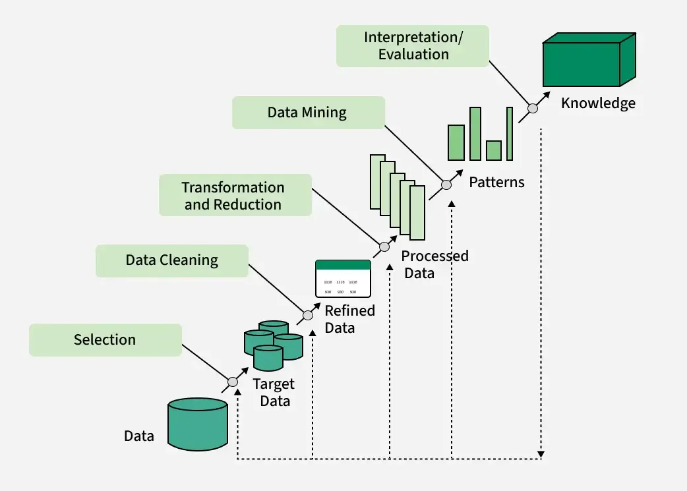
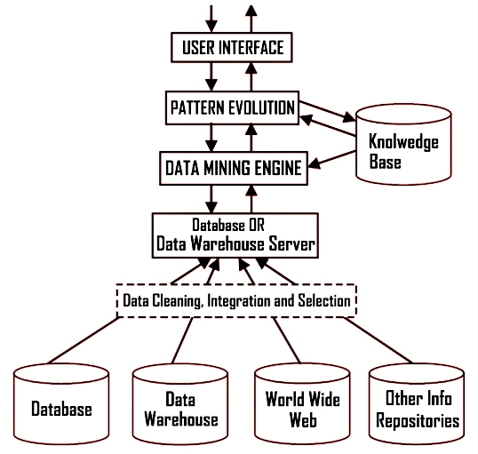
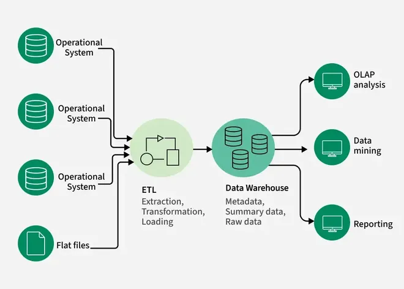

## <mark> 1) What is Data Mining? Explain the importance and functionality of Data Mining. </mark>

**Definition of Data Mining**

Data mining is the process of analyzing large data sets to identify patterns, relationships, and extract useful insights. It involves sorting, filtering, and classifying data to discover hidden trends and information that can help organizations solve business problems and make informed decisions. Data mining uses statistical, mathematical, and machine learning techniques, often as a step in the broader Knowledge Discovery in Databases (KDD) process.

**Importance of Data Mining**

- **Pattern and Trend Discovery:** Data mining uncovers hidden patterns and trends that are not immediately obvious, providing valuable insights for business planning and strategy.
- **Decision Support:** It helps organizations make data-driven decisions by analyzing historical and real-time data, supporting functions such as marketing, sales, fraud detection, risk management, and customer service.
- **Automation and Efficiency:** With the integration of machine learning and artificial intelligence, data mining automates the analysis process, speeding up the extraction of actionable insights.
- **Competitive Advantage:** Businesses can use data mining to forecast market trends, optimize operations, and improve customer satisfaction, giving them an edge over competitors.
- **Cross-Industry Applications:** Data mining is vital across various sectors including finance, healthcare, manufacturing, government, and research, helping organizations to innovate and respond to changing environments.

**Functionality of Data Mining**

- **Descriptive Analysis:** Data mining can describe the characteristics of a dataset, identifying norms and anomalies.
- **Predictive Analysis:** It uses machine learning algorithms to predict future outcomes, such as customer behavior, sales trends, or risk factors.
- **Classification and Clustering:** Data mining techniques like classification (assigning data to predefined categories) and clustering (grouping similar data points) help in segmenting customers, detecting fraud, and organizing information.
- **Association Rule Mining:** This involves discovering relationships between variables in large datasets, commonly used in market basket analysis.
- **Data Reduction:** Techniques like dimensionality reduction or feature selection make large datasets more manageable for analysis without significant loss of information.
- **Text Mining:** Extends data mining to unstructured text data, enabling automatic classification and sentiment analysis.

**Summary Table**

| Aspect        | Description                                                                              |
| ------------- | ---------------------------------------------------------------------------------------- |
| Definition    | Process of analyzing large datasets to find patterns and extract insights                |
| Importance    | Supports decision-making, automation, efficiency, and provides competitive advantage     |
| Functionality | Descriptive/predictive analysis, classification, clustering, association, data reduction |

Data mining transforms raw data into actionable knowledge, enabling organizations to solve complex problems and innovate across industries.

## <mark> 2) Describe the classification of data mining systems. </mark>

The classification of data mining systems helps users select the most suitable approach for specific problems and datasets. These systems can be categorized based on several criteria, including the type of data sources, the kind of knowledge mined, the techniques utilized, and the applications adapted.

### Main Classifications of Data Mining Systems

**1. Classification Based on the Type of Data Sources**

- **Relational Data Mining Systems:** Handle data stored in relational databases using SQL queries and database management techniques.
- **Data Warehouse Mining Systems:** Analyze data from data warehouses, which integrate data from multiple sources for strategic decision-making.
- **Transactional Data Mining Systems:** Focus on mining data from transactions (e.g., sales, financial transactions) for applications like market basket analysis and fraud detection.
- **Multimedia Data Mining Systems:** Process multimedia data such as text, images, audio, and video using specialized algorithms.
- **Spatial and Temporal Data Mining Systems:** Analyze data related to geographical locations (spatial) or time (temporal), useful for weather forecasting and GIS.

**2. Classification Based on the Kind of Knowledge Mined**

- **Descriptive Data Mining Systems:** Focus on describing data properties and identifying patterns, trends, and relationships (e.g., clustering, association rule mining).
- **Predictive Data Mining Systems:** Aim to predict future trends or behaviors using classification, regression, and time-series analysis.

**3. Classification Based on the Techniques Utilized**

- **Machine Learning-Based Systems:** Use supervised, unsupervised, or semi-supervised learning algorithms to adapt and improve models.
- **Statistical-Based Systems:** Rely on statistical methods such as hypothesis testing and regression analysis.
- **Database-Oriented Systems:** Integrate with database management systems and use query languages for data extraction.

**4. Classification Based on Applications**

- **Business Intelligence Systems:** Analyze market trends, customer behavior, and financial performance for business decisions.
- **Healthcare Data Mining Systems:** Analyze patient records and clinical data to improve care and identify disease patterns.
- **Bioinformatics Data Mining Systems:** Focus on biological data for genetic research and drug discovery.
- **Social Network Analysis Systems:** Analyze social network data for marketing, recommendation, and sentiment analysis.

### Summary Table

| Classification Criterion | Example Types/Systems                                                      |
| ------------------------ | -------------------------------------------------------------------------- |
| Type of Data Sources     | Relational, Data Warehouse, Transactional, Multimedia, Spatial/Temporal    |
| Kind of Knowledge Mined  | Descriptive, Predictive                                                    |
| Techniques Utilized      | Machine Learning, Statistical, Database-Oriented                           |
| Applications             | Business Intelligence, Healthcare, Bioinformatics, Social Network Analysis |

This structured approach allows organizations to harness data mining effectively for their specific needs and challenges.

## <mark> 3) What are the major issues in Data Mining? Also discuss the social impact of Data Mining. </mark>

**Major Issues in Data Mining**

Several significant challenges affect the effectiveness and reliability of data mining processes:

- **Data Quality:** Issues such as incomplete, noisy, and inconsistent data can lead to inaccurate results. Missing or incorrect values, errors, and discrepancies between data sources hinder the mining process and interpretation of results[2][5][6].
- **Data Integration:** Combining data from multiple, heterogeneous sources is complex due to differences in schema, semantics, and formats. Poor integration can result in data redundancy and incoherent results[5][6].
- **Scalability:** As data volumes grow, traditional data mining algorithms may struggle to process large datasets efficiently. Scalability is a major concern in big data environments[4][5][8].
- **Data Privacy and Security:** Mining personal or sensitive data raises serious privacy concerns. Protecting individuals’ information from unauthorized access and breaches is critical[4][5].
- **Algorithm Selection:** Choosing the right algorithm for a specific task is not straightforward. Different algorithms have varying strengths, and selecting an inappropriate one can lead to suboptimal results[5].
- **Interpretability of Results:** Data mining outputs can be complex and difficult to interpret, making it challenging for decision-makers to extract actionable insights[5].
- **Dynamic Data:** Data often changes over time, requiring techniques that can adapt to new information and update models accordingly[5].
- **Computational Complexity:** Large-scale data mining is computationally intensive, demanding significant processing power and memory[5].
- **Legal and Ethical Issues:** Data mining can lead to legal and ethical dilemmas, especially regarding consent and the use of personal data. Organizations must navigate these issues to avoid legal repercussions and maintain trust[4][5].
- **Domain Knowledge:** Lack of domain expertise can hinder the effective application and interpretation of data mining results, making collaboration between technical and domain experts essential[1][3].

**Social Impact of Data Mining**

Data mining has profound social implications:

- **Privacy Concerns:** The collection and analysis of personal data can infringe on individual privacy, especially when sensitive information is involved. There is a risk of misuse, surveillance, and unauthorized profiling[4][5].
- **Ethical Considerations:** Data mining raises questions about consent, transparency, and the ethical use of data. Organizations must consider the potential harm to individuals and communities, particularly when data is used for decision-making in sensitive areas such as employment, healthcare, and law enforcement[4][5].
- **Discrimination and Bias:** Data mining models can inadvertently perpetuate or amplify existing biases present in the data, leading to unfair treatment of certain groups[5].
- **Security Risks:** The aggregation of large datasets increases the risk of data breaches and cyberattacks, potentially exposing individuals to identity theft or other harms[4][5].
- **Positive Social Outcomes:** When used responsibly, data mining can lead to improved public services, better healthcare, enhanced customer experiences, and more efficient resource allocation. It can also help detect fraud, improve safety, and support scientific research[4][5].

In summary, while data mining offers significant benefits, it must be managed carefully to address its major issues and mitigate its social impacts.

## <mark> 4) Briefly explain different types of Applications of Data Mining. </mark>

Data mining is widely applied across various domains, leveraging its ability to uncover patterns, predict trends, and optimize decision-making. Here are brief explanations of some key types of applications:

- **Retail and E-Commerce:**
  - **Market Basket Analysis:** Identifies products frequently bought together, enabling effective promotions and bundling strategies.
  - **Personalized Recommendations:** Analyzes user behavior and purchase history to suggest relevant products, boosting sales and customer satisfaction.
  - **Demand Forecasting:** Predicts future demand to optimize inventory and reduce shortages or overstock[1][6].
- **Telecommunications:**
  - **Customer Churn Prediction:** Identifies customers likely to switch providers, allowing targeted retention strategies.
  - **Network Optimization:** Monitors and improves network performance by detecting bottlenecks and allocating resources efficiently[1][6].
- **Healthcare:**
  - **Patient Analysis:** Helps in diagnosing diseases, predicting patient outcomes, and identifying at-risk groups.
  - **Medical Research:** Facilitates the analysis of clinical data and biological datasets for drug discovery and genetic research[3][4].
- **Finance and Banking:**
  - **Fraud Detection:** Uses anomaly detection to identify suspicious transactions and prevent financial crimes.
  - **Credit Scoring:** Analyzes customer data to assess creditworthiness and manage loan portfolios[4][5].
- **Education:**
  - **Student Performance Analysis:** Tracks student progress and identifies those needing support.
  - **Customized Learning:** Adapts educational content based on individual learning patterns for better outcomes[1][3].
- **Criminal Investigation:**
  - **Crime Pattern Analysis:** Groups crime data to identify patterns, enabling predictive policing and resource allocation[6].
- **Supply Chain Management:**
  - **Demand Analysis:** Predicts demand patterns to optimize inventory and distribution channels[3].
- **Marketing and Advertising:**
  - **Targeted Campaigns:** Segments customers and personalizes marketing efforts for higher engagement and conversion[3][8].
- **Media and Entertainment:**
  - **Content Recommendation:** Analyzes audience preferences to recommend shows, music, or articles, improving user experience[3].
- **Scientific Research:**
  - **Biological Data Analysis:** Analyzes genetic, protein, or environmental data to advance research in biology and other sciences[3][5].

These applications demonstrate the versatility and impact of data mining across industries, driving efficiency, innovation, and improved decision-making.

## <mark> 5) Explain the architecture of Data Mining. </mark>

The architecture of a data mining system is designed to efficiently extract meaningful patterns and insights from large volumes of data. It typically consists of several interconnected components, each serving a specific function in the data mining process. Here is an overview of the main architectural components and their roles:

### Key Components of Data Mining Architecture

- **Data Sources**

  - **Description:** Data mining systems collect data from multiple sources such as databases, data warehouses, spreadsheets, text files, and the World Wide Web.
  - **Role:** Provides the raw data required for analysis. Data may need to be cleaned, integrated, and selected before being processed[3][5][7].

- **Database or Data Warehouse Server**

  - **Description:** This is the central repository where data is stored and managed.
  - **Role:** Retrieves relevant data based on user requests and ensures that only the necessary data is passed to the mining engine[2][5][6].

- **Knowledge Base**

  - **Description:** Contains domain knowledge, concept hierarchies, user beliefs, and metadata.
  - **Role:** Guides the data mining process, helps in evaluating the interestingness of patterns, and may include thresholds or constraints for filtering results[2][5][6].

- **Data Mining Engine**

  - **Description:** The core component of the system, consisting of various modules for different mining tasks.
  - **Role:** Performs essential data mining operations such as association, classification, clustering, prediction, and outlier detection[2][3][5].

- **Pattern Evaluation Module**

  - **Description:** Assesses the interestingness or relevance of discovered patterns using thresholds or interestingness measures.
  - **Role:** Filters out uninteresting patterns and focuses the mining process on meaningful insights[2][5][6].

- **Graphical User Interface (GUI)**
  - **Description:** Provides an interactive interface for users to interact with the data mining system.
  - **Role:** Allows users to enter queries, select data, specify mining tasks, and visualize results in an understandable format[2][3][5].

### Layered View of Data Mining Architecture

Some architectures are described in three main layers:

- **Data Layer:** Contains the data sources and data warehouse or database server.
- **Application Layer:** Includes the data mining engine and pattern evaluation modules.
- **Front-End Layer:** Comprises the graphical user interface for user interaction and result visualization[1][3].

### Summary Table

| Component                | Description & Role                                      |
| ------------------------ | ------------------------------------------------------- |
| Data Sources             | Collects raw data from various repositories             |
| Database/Data Warehouse  | Stores and retrieves relevant data for mining           |
| Knowledge Base           | Provides domain knowledge and guides pattern evaluation |
| Data Mining Engine       | Executes core mining algorithms                         |
| Pattern Evaluation       | Assesses and filters interesting patterns               |
| Graphical User Interface | Enables user interaction and result visualization       |

This architecture ensures that data mining systems can efficiently process, analyze, and present valuable insights from complex and large datasets[1][2][3].

## <mark> 6) What is the KDD process? Explain the steps involved in the KDD process with a suitable Diagram. </mark>

**Knowledge Discovery in Databases (KDD)** is the comprehensive, multi-step process of extracting useful, actionable knowledge from large volumes of data. It encompasses everything from initial data understanding to the final application of discovered knowledge, with data mining as a core component but not the entire process[4][2][1].

### Steps Involved in the KDD Process

1. **Understanding the Domain and Goals**

   - **Description:** Gain a clear understanding of the application domain, prior knowledge, and the objectives of the end-user. This step is crucial for setting the right direction for the entire process[1][4].
   - **Activities:** Define the problem, understand the data, and set analytical goals.

2. **Data Selection**

   - **Description:** Identify and select relevant data sources and subsets for analysis[2][3][5].
   - **Activities:** Choose databases, data warehouses, or specific datasets pertinent to the goal.

3. **Data Preprocessing (Cleaning and Integration)**

   - **Description:** Cleanse the data to remove noise, handle missing values, and integrate data from multiple sources into a coherent dataset[2][3][5].
   - **Activities:** Fill missing values, smooth noisy data, remove outliers, integrate schemas, resolve inconsistencies.

4. **Data Transformation**

   - **Description:** Transform the data into a suitable format for mining, often involving reduction, aggregation, normalization, or discretization[2][3][4].
   - **Activities:** Reduce dimensionality, normalize data, aggregate values, discretize continuous variables.

5. **Data Mining (Pattern Discovery)**

   - **Description:** Apply data mining algorithms to discover patterns, relationships, or trends in the data[2][3][4].
   - **Activities:** Use classification, clustering, association rule mining, anomaly detection, etc.

6. **Pattern Evaluation (Knowledge Evaluation)**

   - **Description:** Assess the discovered patterns for validity, novelty, usefulness, and understandability[2][4].
   - **Activities:** Filter out uninteresting patterns, evaluate significance, and select valuable insights.

7. **Knowledge Representation (Visualization and Reporting)**

   - **Description:** Present the discovered knowledge in a comprehensible and actionable format for end-users[2][4].
   - **Activities:** Use visualization tools, reports, dashboards, or summaries to communicate results.

8. **Deployment (Optional)**
   - **Description:** Integrate the knowledge into decision-making processes or operational systems for practical use[2].
   - **Activities:** Implement insights into business processes, software, or decision support systems.

### KDD Process Diagram

Below is a simplified diagrammatic representation of the KDD process:



This diagram reflects the iterative and interactive nature of the KDD process, where feedback from later stages may prompt revisiting earlier steps for refinement[4][2][3].

---

**Summary Table**

| Step                         | Description                                |
| ---------------------------- | ------------------------------------------ |
| Understanding Domain & Goals | Set objectives and understand data context |
| Data Selection               | Choose relevant data sources               |
| Data Preprocessing           | Clean and integrate data                   |
| Data Transformation          | Transform data for mining                  |
| Data Mining                  | Discover patterns using algorithms         |
| Pattern Evaluation           | Assess and filter patterns                 |
| Knowledge Representation     | Visualize and present knowledge            |
| Deployment                   | Apply knowledge in real-world applications |

## <mark> 7) What is a Data Warehouse? Briefly state difference between data warehouse & data mart? </mark>

A **data warehouse** is a centralized repository of integrated data from multiple sources, designed to support business intelligence (BI) activities such as reporting, analysis, and decision-making. It stores current and historical data, organizes it for efficient querying, and enables organizations to analyze trends and make informed decisions[4][7][10].

**Difference between Data Warehouse and Data Mart**

| Feature            | Data Warehouse                                           | Data Mart                                          |
| ------------------ | -------------------------------------------------------- | -------------------------------------------------- |
| **Scope**          | Enterprise-wide; covers the entire organization          | Departmental or subject-specific                   |
| **Data Sources**   | Multiple, diverse sources across the organization        | Limited, focused on a specific business unit       |
| **Size**           | Large-scale, stores vast amounts of historical data      | Smaller, contains summarized or subset data        |
| **Purpose**        | Supports strategic decision-making for the whole company | Supports tactical decision-making for a department |
| **Complexity**     | High, due to integration and consolidation               | Lower, easier to design and maintain               |
| **Implementation** | Time-consuming and resource-intensive                    | Faster and less expensive to implement             |

A **data mart** is essentially a subset of a data warehouse, focused on a particular line of business, function, or department within an organization[4][7].

## <mark> 8) What is the difference between OLTP and OLAP? Explain it. </mark>

**OLTP (Online Transaction Processing)** and **OLAP (Online Analytical Processing)** are two fundamentally different approaches to data processing, each serving distinct purposes within organizations.

### Key Differences

| Feature               | OLTP                                                                | OLAP                                                      |
| --------------------- | ------------------------------------------------------------------- | --------------------------------------------------------- |
| **Purpose**           | Handles real-time transactional operations (e.g., orders, payments) | Supports complex data analysis and reporting              |
| **Data Source**       | Current, operational data from live transactions                    | Aggregated historical data from OLTP and other sources    |
| **Data Model**        | Normalized (3NF) for data integrity and efficiency                  | Denormalized (star/snowflake schema) for query speed      |
| **Query Type**        | Simple, short, frequent (CRUD: Create, Read, Update, Delete)        | Complex, analytical, involving aggregations and joins     |
| **Users**             | Frontline staff, clerks, customer service                           | Analysts, executives, business intelligence professionals |
| **Data Volume**       | Smaller datasets (GB to TB)                                         | Large datasets (TB to PB)                                 |
| **Operations**        | Frequent updates, real-time data modification                       | Infrequent updates, mostly read operations                |
| **Performance Focus** | Fast transaction processing, high availability                      | Fast query performance on large data volumes              |
| **Examples**          | ATM transactions, e-commerce orders, hotel reservations             | Sales trend analysis, financial reporting, forecasting    |

### Explanation

- **OLTP** systems are designed for managing and processing day-to-day transactions in real time. They handle high volumes of simple transactions, such as inserting a new order, updating inventory, or processing a payment. The data is typically normalized to minimize redundancy and ensure consistency[1][3][5].
- **OLAP** systems are optimized for complex analytical queries and reporting. They use aggregated, historical data from OLTP and other sources, often stored in data warehouses or data marts. OLAP enables users to view data from multiple dimensions (e.g., sales by region, time, product), supporting business intelligence and decision-making[1][3][5].

In summary, **OLTP** is about running the business, while **OLAP** is about understanding and improving it through data analysis.

## <mark> 9) How does OLAP work? Explain OLAP operations with Suitable Diagrams and examples. </mark>

OLAP (Online Analytical Processing) enables users to analyze multidimensional data interactively from multiple perspectives, supporting business intelligence and decision-making by providing rapid, flexible access to summarized data[1][2][4].

### How OLAP Works

1. **Data Collection and Preparation**
   - **OLAP servers collect data** from various sources such as relational databases and data warehouses.
   - **ETL (Extract, Transform, Load) processes** clean, aggregate, and pre-calculate data before storing it in an OLAP cube—a multidimensional data structure[1][2][6].
2. **Data Storage and Organization**
   - **Data is organized into cubes** with multiple dimensions (e.g., time, product, region, customer).
   - **Each dimension** is populated by members (e.g., months, products, countries) and can be organized hierarchically (e.g., year → quarter → month)[2][6].
3. **Querying and Analysis**
   - **Users perform queries** using specialized languages like MDX (Multidimensional Expressions) to retrieve and analyze data.
   - **OLAP tools** allow analysts to generate reports, dashboards, and visualizations from the cube[1][2].
4. **Analysis Operations**
   - **Roll-up (Consolidation):** Aggregates data to higher levels (e.g., sales by city → sales by country).
   - **Drill-down:** Breaks data into more detailed views (e.g., sales by country → sales by city).
   - **Slice:** Selects data on one dimension (e.g., sales for Q1).
   - **Dice:** Selects data on two or more dimensions (e.g., sales for Q1 and Q2 in Toronto and Vancouver).
   - **Pivot (Rotate):** Changes the dimensional orientation for alternative views (e.g., swapping rows and columns)[3][4][5].

### OLAP Operations Explained with Diagrams and Examples

#### 1. Roll-up (Consolidation)

**Example:**  
Sales data is initially available by city. Rolling up aggregates sales to the country or region level.

```
[City] ---(Roll-up)--> [Region] ---(Roll-up)--> [Country]
```

**Diagram (Conceptual):**

```
City:   [Ahmedabad, Surat, Mumbai]
Roll-up:
Region: [Gujarat, Maharashtra]
Roll-up:
Country: [India]
```

#### 2. Drill-down

**Example:**  
Starting with sales by country, drill-down reveals sales by region, then by city.

```
[Country] ---(Drill-down)--> [Region] ---(Drill-down)--> [City]
```

**Diagram (Conceptual):**

```
Country: [India]
Drill-down:
Region: [Gujarat, Maharashtra]
Drill-down:
City: [Ahmedabad, Surat, Mumbai]
```

#### 3. Slice

**Example:**  
Selecting sales data for a specific time period (e.g., Q1).

```
Sales Cube: [Time, Product, Region]
Slice:      [Time = Q1, Product, Region]
```

**Diagram (Conceptual):**

```
Before Slice: All quarters (Q1, Q2, Q3, Q4)
After Slice: Only Q1 data
```

#### 4. Dice

**Example:**  
Selecting sales for Q1 and Q2 in Toronto and Vancouver for Mobile and Modem.

```
Sales Cube: [Time, Location, Product]
Dice:       [Time = Q1 or Q2, Location = Toronto or Vancouver, Product = Mobile or Modem]
```

**Diagram (Conceptual):**

```
All data: [All times, All locations, All products]
Dice:     [Q1/Q2, Toronto/Vancouver, Mobile/Modem]
```

#### 5. Pivot (Rotate)

**Example:**  
Changing the view from "Sales by Product and Time" to "Sales by Time and Product."

```
Original:   [Product] x [Time]
Pivot:      [Time] x [Product]
```

**Diagram (Conceptual):**

```
Before Pivot:
| Product   | Q1  | Q2  |
|-----------|-----|-----|
| Mobile    | 100 | 120 |
| Modem     | 80  | 90  |

After Pivot (Rotate):
| Time | Mobile | Modem |
|------|--------|-------|
| Q1   | 100    | 80    |
| Q2   | 120    | 90    |
```

### Summary Table of OLAP Operations

| Operation  | Description                               | Example                              |
| ---------- | ----------------------------------------- | ------------------------------------ |
| Roll-up    | Aggregates data to higher level           | City → Region → Country              |
| Drill-down | Breaks data into more detailed levels     | Country → Region → City              |
| Slice      | Selects data on one dimension             | Sales for Q1                         |
| Dice       | Selects data on two or more dimensions    | Sales for Q1/Q2 in Toronto/Vancouver |
| Pivot      | Rotates axes for alternative presentation | Swap rows and columns                |

OLAP empowers users to navigate and analyze data flexibly, supporting deeper insights and informed decision-making[1][3][7].

## <mark> 10) Define data warehouse architecture with suitable diagram. </mark>

**Data warehouse architecture** refers to the structured design and arrangement of components that enable the storage, management, and retrieval of large volumes of data for analytical processing and business intelligence. It ensures data is integrated from various sources, transformed, and made available for end-users in a consistent and efficient manner[2][5][8].

### Main Components of Data Warehouse Architecture

- **Data Sources Layer:**
  - **Description:** Includes operational databases, external data providers, flat files, web services, and IoT devices.
  - **Role:** Provides raw data to the warehouse[5][8][6].
- **Data Staging Area:**
  - **Description:** An intermediate storage area where data is cleaned, transformed, and validated before loading.
  - **Role:** Ensures data quality and consistency before it enters the warehouse[8][1][5].
- **ETL (Extract, Transform, Load) Layer:**
  - **Description:** Processes that extract data from sources, transform it for consistency, and load it into the warehouse.
  - **Role:** Handles data integration and preparation[6][9][2].
- **Core Data Warehouse (Warehouse Layer):**
  - **Description:** The central repository for integrated, subject-oriented, non-volatile, and time-variant data.
  - **Role:** Stores current and historical data for analysis[1][8][2].
- **Metadata Repository:**
  - **Description:** Stores information about the data warehouse structure, data lineage, and business rules.
  - **Role:** Provides context and aids in data management[2][5][7].
- **Data Marts:**
  - **Description:** Subsets of the data warehouse tailored for specific business units or functions.
  - **Role:** Supports departmental analytics and reporting[11][8][5].
- **Access Tools (Presentation Layer):**
  - **Description:** Tools for querying, reporting, data mining, and OLAP.
  - **Role:** Enables end-users to interact with and analyze data[2][7][5].

### Data Warehouse Architecture Diagram

Below is a simplified diagram of a typical data warehouse architecture:



### Explanation

- **Data flows from various sources** into the staging area, where it is cleaned and prepared.
- **ETL processes** transform and load the data into the core data warehouse.
- **Metadata** provides context and manages the structure of the warehouse.
- **Data marts** offer specialized views for different business units.
- **Access tools** allow users to analyze and visualize the data.

This architecture ensures a robust, scalable, and flexible foundation for business intelligence and analytics[2][5][8].

## <mark> 11) Explain Data warehouse development approaches with its advantages & disadvantages. </mark>

Data warehouse development approaches define the strategies and methodologies used to design, build, and maintain data warehouses. The most widely recognized approaches are **Inmon (Top-Down), Kimball (Bottom-Up), and Data Vault**. Each offers distinct advantages and disadvantages.

### Main Data Warehouse Development Approaches

#### 1. Inmon (Top-Down) Approach

- **Description:**
  - **Enterprise-wide focus:** Builds a centralized, integrated data warehouse in third normal form (3NF), serving as the single source of truth for the entire organization.
  - **Subject-oriented, non-volatile, time-variant, and integrated.**
  - **Data marts are created from the central warehouse for specific business needs.**
- **Advantages:**
  - **Consistency:** Ensures data consistency and integrity across the organization.
  - **Clear Data Lineage:** Provides traceability and auditability.
  - **Stability:** Serves as a stable foundation for various business needs.
  - **Strong Data Governance:** Easier to enforce data governance policies.
- **Disadvantages:**
  - **Long Development Time:** Requires significant upfront design and integration.
  - **Complexity:** Implementation can be complex and resource-intensive.
  - **Limited Agility:** Adapting to new requirements or data sources can be challenging[6][8][7].

#### 2. Kimball (Bottom-Up) Approach

- **Description:**
  - **Departmental focus:** Starts with building data marts for specific business processes or departments using dimensional modeling (star schema).
  - **Data marts are integrated into a data warehouse bus architecture for enterprise-wide use.**
- **Advantages:**
  - **Faster Implementation:** Quicker delivery of business value as data marts are built and deployed incrementally.
  - **Simplicity:** Easier to design and maintain for specific business needs.
  - **Flexibility:** Allows for iterative development and easy adaptation to changing requirements.
- **Disadvantages:**
  - **Potential Redundancy:** Risk of data redundancy and inconsistency if not managed carefully.
  - **Integration Challenges:** Requires careful planning to ensure data marts can be integrated into a coherent warehouse.
  - **Limited Enterprise View:** May not provide a comprehensive enterprise-wide perspective if not properly architected[8][5][1].

#### 3. Data Vault Approach

- **Description:**
  - **Agile, scalable:** Uses a hub, link, and satellite model to enable incremental, agile development.
  - **Designed for flexibility and rapid adaptation to changing business requirements.**
- **Advantages:**
  - **Agility:** Supports rapid changes and additions to the data model.
  - **Scalability:** Easily accommodates new data sources and business requirements.
  - **Auditability:** Provides clear data lineage and history.
  - **Parallel Development:** Allows multiple teams to work on different parts of the warehouse simultaneously.
- **Disadvantages:**
  - **Complex Modeling:** Requires specialized knowledge of the Data Vault methodology.
  - **Performance Overhead:** May introduce query complexity and performance challenges.
  - **Steeper Learning Curve:** Newer and less widely adopted than Inmon or Kimball[6].

### Comparison Table

| Approach       | Key Features                        | Advantages                                       | Disadvantages                                    |
| -------------- | ----------------------------------- | ------------------------------------------------ | ------------------------------------------------ |
| **Inmon**      | Top-down, centralized, 3NF          | Consistency, governance, stability, lineage      | Long development, complex, less agile            |
| **Kimball**    | Bottom-up, dimensional, data marts  | Fast delivery, simplicity, flexibility           | Redundancy, integration challenges, limited view |
| **Data Vault** | Agile, hub/link/satellite, scalable | Agility, scalability, auditability, parallel dev | Complex modeling, performance, learning curve    |

### Summary

- **Inmon** is best for organizations needing a comprehensive, stable, and governed data warehouse.
- **Kimball** is suitable for rapid, departmental solutions with iterative development.
- **Data Vault** is ideal for environments requiring agility, scalability, and adaptability to change.

Choosing the right approach depends on organizational goals, resources, and the need for agility versus consistency[8][6][5].

## <mark> 12) Write short notes on Multidimensional Data Model with examples. </mark>

A **multidimensional data model** organizes data into logical structures called cubes, which allow users to view and analyze information from multiple perspectives or dimensions such as time, product, location, and customer[1][4][3]. This model is central to data warehousing and OLAP (Online Analytical Processing) systems, supporting fast, flexible, and intuitive data analysis for business intelligence.

### Key Components

- **Facts:** Quantitative data points that are measured and analyzed (e.g., sales amount, profit)[5][7].
- **Dimensions:** Descriptive attributes that provide context to facts (e.g., time, product, location, customer)[4][5][3].
- **Measures:** Numeric values associated with facts (e.g., total sales, count of transactions).
- **Hierarchies:** Levels within dimensions that allow aggregation (e.g., time: day → month → quarter → year)[3][7].

### Example

Consider a retail business tracking sales:

- **Facts:** Sales amount, number of items sold.
- **Dimensions:**
  - **Time:** Day, month, quarter, year.
  - **Product:** Product category, product name.
  - **Location:** City, region, country.
  - **Customer:** Customer segment, customer ID.

This setup allows queries such as, "What were the total sales of smartphones in Gujarat during Q1 2024?" by slicing and dicing the data cube along different dimensions[4][7].

### Visualization

Imagine a Rubik’s cube where each side represents a different dimension (time, product, location). Each cell in the cube contains a fact (e.g., sales), and users can rotate or slice the cube to view data from any perspective[4][2][1].

> **"Data is the new oil, and multidimensional models are the refineries."**  
> — Clive Humby, Data Scientist[4]

### Summary Table

| Component | Description                | Example                 |
| --------- | -------------------------- | ----------------------- |
| Fact      | Quantitative data          | Sales amount            |
| Dimension | Descriptive attribute      | Time, Product, Location |
| Measure   | Numeric value for analysis | Total sales, Count      |
| Hierarchy | Levels within a dimension  | Day→Month→Year          |

Multidimensional data models make complex data analysis intuitive and efficient, enabling organizations to uncover trends and make data-driven decisions[1][4][3].

## <mark> 13) Describe the following terms in Data warehouse design schema: (a) Star schema (b) Snowflake schema (c) Fact constellation schema </mark>

Here are concise descriptions of the three key data warehouse design schemas:

---

### **(a) Star Schema**

- **Definition:**  
  The star schema is a simple and widely used data warehouse design. It consists of a central fact table connected to multiple dimension tables, forming a star-like structure.
- **Structure:**
  - **Fact Table:** Contains quantitative data (facts) such as sales, revenue, or transactions.
  - **Dimension Tables:** Surround the fact table and provide descriptive context (e.g., time, product, customer, location).
- **Characteristics:**
  - **Denormalized:** Dimension tables are typically denormalized to reduce joins and improve query performance.
  - **Simple to Understand:** Easy to implement and maintain.
  - **Fast Query Performance:** Due to fewer joins and denormalized data.
- **Example:**
  - **Fact Table:** Sales
  - **Dimension Tables:** Date, Product, Customer, Store

---

### **(b) Snowflake Schema**

- **Definition:**  
  The snowflake schema is an extension of the star schema where dimension tables are normalized into multiple related tables, creating a snowflake-like structure[1][5][7].
- **Structure:**
  - **Fact Table:** Central table with business metrics.
  - **Dimension Tables:** Surrounded by subdimension tables (e.g., a product dimension table may be split into product, category, and supplier tables).
- **Characteristics:**
  - **Normalized:** Reduces data redundancy and saves storage space.
  - **Complexity:** More tables mean more joins, which can slow down queries.
  - **Maintenance:** Higher maintenance due to increased number of tables.
- **Example:**
  - **Fact Table:** Sales
  - **Dimension Tables:** Product (linked to Category and Supplier tables), Date, Customer, Store

---

### **(c) Fact Constellation Schema (Galaxy Schema)**

- **Definition:**  
  The fact constellation schema (also called galaxy schema) is a more complex arrangement where multiple fact tables share dimension tables[5].
- **Structure:**
  - **Multiple Fact Tables:** Each fact table is connected to its own set of dimension tables.
  - **Shared Dimensions:** Some dimension tables are shared among multiple fact tables (conformed dimensions).
- **Characteristics:**
  - **Flexibility:** Supports complex analytical scenarios and multiple business processes.
  - **Complexity:** More complex to design and maintain than star or snowflake schemas.
  - **Analytical Power:** Enables comprehensive analysis across different business events.
- **Example:**
  - **Fact Tables:** Sales, Inventory, Shipping
  - **Shared Dimension Tables:** Date, Product, Customer

---

### Summary Table

| Schema Type            | Structure                        | Key Features                | Example Use Case           |
| ---------------------- | -------------------------------- | --------------------------- | -------------------------- |
| **Star**               | 1 fact + denormalized dimensions | Simple, fast, easy to use   | Sales analysis             |
| **Snowflake**          | 1 fact + normalized dimensions   | Reduced redundancy, complex | Detailed product hierarchy |
| **Fact Constellation** | Multiple facts + shared dims     | Flexible, powerful, complex | Cross-process analytics    |

## <mark> 14) Explain the process of Data Mining and Data Warehouse with suitable diagrams. Also compare Data Warehouse and Data Mining. </mark>

Let's break down the process of **Data Mining** and **Data Warehouse**, illustrate each with suitable diagrams, and compare them.

---

### **Data Warehouse: Process and Diagram**

#### **Process**

A data warehouse is a centralized repository that integrates data from multiple sources, transforming and storing it for analytical purposes. The typical process includes:

1. **Data Extraction:** Data is extracted from various sources (databases, files, APIs, etc.).
2. **Data Staging:** Raw data is cleaned, transformed, and validated in a staging area.
3. **ETL (Extract, Transform, Load):** Data is processed and loaded into the warehouse.
4. **Warehouse Storage:** Data is stored in subject-oriented, integrated, non-volatile, and time-variant structures.
5. **Data Access:** Users access and analyze the data using reporting, analytics, and OLAP tools[1][6][10].

#### **Diagram**



---

### **Data Mining: Process and Diagram**

#### **Process**

Data mining is the process of discovering patterns and insights from large datasets, typically stored in data warehouses. The process often follows the **KDD (Knowledge Discovery in Databases)** framework:

1. **Data Selection:** Choose relevant data from the warehouse.
2. **Data Preprocessing:** Clean, integrate, and transform data for analysis.
3. **Data Mining:** Apply algorithms (classification, clustering, association, etc.) to extract patterns.
4. **Pattern Evaluation:** Assess the discovered patterns for validity and usefulness.
5. **Knowledge Presentation:** Visualize and present insights for decision-making.

#### **Diagram**


---

### **Comparison: Data Warehouse vs. Data Mining**

| Feature        | Data Warehouse                                      | Data Mining                                         |
| -------------- | --------------------------------------------------- | --------------------------------------------------- |
| **Purpose**    | Centralized storage for integrated, historical data | Discover patterns and insights from stored data     |
| **Process**    | ETL, data integration, storage, access              | Data selection, preprocessing, mining, evaluation   |
| **Output**     | Organized, queryable data                           | Patterns, trends, actionable insights               |
| **Users**      | Analysts, executives, BI professionals              | Analysts, data scientists, business users           |
| **Techniques** | Schema design (star, snowflake), ETL, OLAP          | Classification, clustering, association, prediction |
| **Role in BI** | Foundation for analytics and reporting              | Advanced analytics and decision support             |

---

### **Summary**

- **Data Warehouse:** Provides the infrastructure for storing and managing data for analysis[1][6][10].
- **Data Mining:** Extracts meaningful patterns and insights from the data stored in the warehouse.
- **Relationship:** Data mining relies on the data warehouse for clean, integrated data, while the warehouse enables efficient data mining by organizing data for easy access and analysis.

## <mark> 15) Explain the following in OLAP <br /> a) Roll up operation <br /> b) Drill Down operation <br /> c) Slice operation <br /> d) Dice operation <br /> e) Pivot operation </mark>

OLAP (Online Analytical Processing) enables users to analyze multidimensional data from multiple perspectives. The main OLAP operations are explained below:

---

### **a) Roll-up Operation**

- **Description:**  
  The roll-up (or drill-up) operation aggregates data by climbing up a concept hierarchy within a dimension or by reducing the number of dimensions. It summarizes data to a higher, less detailed level.
- **How it works:**
  - **Climbing up a hierarchy:** For example, moving from “city” to “state” to “country” in a location dimension.
  - **Dimension reduction:** Removing one or more dimensions to see summarized data.
- **Example:**
  - **Original:** Sales by city.
  - **Roll-up:** Sales by country (aggregating all cities within each country)[2][4][5].
- **Effect:**
  - Provides a broader, summarized view of the data.

---

### **b) Drill Down Operation**

- **Description:**  
  Drill down is the reverse of roll-up. It navigates from a higher summary level to a more detailed level within a dimension or by adding new dimensions.
- **How it works:**
  - **Stepping down a hierarchy:** For example, moving from “quarter” to “month” in a time dimension.
  - **Adding dimensions:** Introducing more details by adding new dimensions.
- **Example:**
  - **Original:** Sales by quarter.
  - **Drill-down:** Sales by month within each quarter[2][3][4].
- **Effect:**
  - Reveals more granular, detailed data for in-depth analysis.

---

### **c) Slice Operation**

- **Description:**  
  The slice operation selects a single value for one dimension to create a sub-cube from the original cube.
- **How it works:**
  - **Selects one dimension:** For example, viewing sales for the year 2020 in a cube with dimensions: time, product, and location.
  - **Result:** A two-dimensional table (if the cube is three-dimensional).
- **Example:**
  - **Original:** Sales by year, product, location.
  - **Slice:** Sales by product and location for year 2020[2][4][5].
- **Effect:**
  - Focuses analysis on a specific subset of the data.

---

### **d) Dice Operation**

- **Description:**  
  The dice operation selects a sub-cube by specifying values for two or more dimensions.
- **How it works:**
  - **Selects multiple dimensions:** For example, viewing sales for specific quarters, products, and locations.
  - **Result:** A smaller cube (sub-cube) based on the selected criteria.
- **Example:**
  - **Original:** Sales by quarter, product, location.
  - **Dice:** Sales for Q1 and Q2, products “Mobile” and “Modem,” in Toronto and Vancouver[2][4][5].
- **Effect:**
  - Provides a focused view of data for specific combinations of dimensions.

---

### **e) Pivot Operation**

- **Description:**  
  The pivot (or rotate) operation changes the dimensional orientation of the data cube, allowing users to view data from different perspectives.
- **How it works:**
  - **Rotates axes:** For example, swapping rows and columns in a report.
- **Example:**
  - **Original:** Sales by product (rows) and time (columns).
  - **Pivot:** Sales by time (rows) and product (columns)[2][4][5].
- **Effect:**
  - Enables alternative visualizations and comparisons of data.

---

These operations empower users to interactively explore and analyze multidimensional data for deeper insights.
