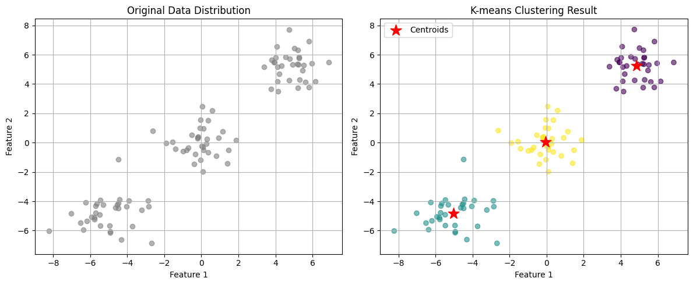
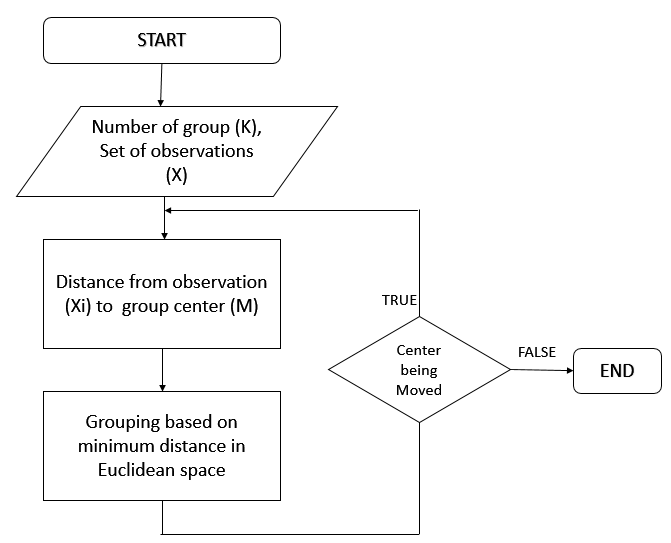
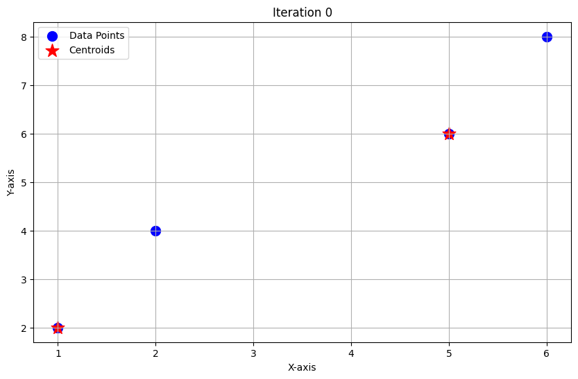
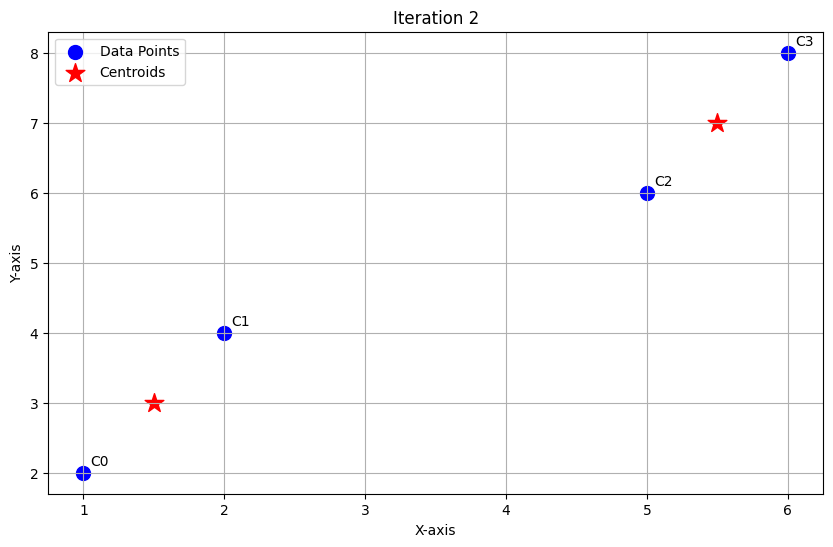

## <mark> 1) Explain the working of K-Nearest Neighbour (KNN) algorithm with an example. </mark>

### K-Nearest Neighbour (KNN) Algorithm: Working Principle

**K-Nearest Neighbour (KNN)** is a simple, non-parametric, supervised learning algorithm used mostly for **classification**, but also for regression. It predicts the label of a new data point based on the labels of its closest neighbors in the training data.

### Step-by-Step Working

1. **Choose 'k':** Decide how many neighbors (k) to consider. Common values are k=3, 5, or 7.
2. **Measure Distance:** For a new point, calculate its distance (often Euclidean) from all training points.
3. **Find k Nearest Neighbors:** Identify the k points in the training data that are closest to the new point.
4. **Voting (for Classification):** The new point is assigned the class most common among these k neighbors (majority vote).
   - For regression, the algorithm averages the values of its k nearest neighbors.

### Example

Imagine you have data on fruit shapes and want to classify a new fruit:

- Your dataset has apples and bananas labeled by features like weight and color.
- For a new fruit, KNN measures its "distance" from all known fruits using those features.
- If k=3, and among the 3 closest fruits, 2 are apples and 1 is a banana, the new fruit is classified as an **apple** (majority vote).

### Key Points

- **Instance-Based:** KNN stores all training data and makes decisions only when predicting (no model is learned in advance).
- **No Distribution Assumptions:** It doesn’t assume anything about the underlying data distribution.
- **Choice of 'k':** Too low (k=1) makes it sensitive to noise; too high can make it overlook patterns. Cross-validation is used to select a good value of k.

### Visual Recap

- New data point → Compare to all others → Find nearest neighbors → Assign class by majority.

## <mark> 2) Write the formula for entropy and Gini impurity index, and explain how they are used in decision tree splitting. </mark>

### Entropy and Gini Impurity: Formulas and Decision Tree Splitting

### 1. **Entropy Formula**

Entropy measures the impurity or disorder in a dataset node:

$$
\text{Entropy}(S) = - \sum_{i=1}^n p_i \log_2 p_i
$$

- Here, $$p_i$$ is the probability of class $$i$$ in dataset $$S$$, and $$n$$ is the number of unique classes.

- **Example:** In a node with 60% "cat" and 40% "dog":
  $$
  \text{Entropy} = - (0.6 \log_2 0.6 + 0.4 \log_2 0.4)
  $$

### 2. **Gini Impurity Formula**

Gini impurity measures the probability of incorrectly classifying a randomly chosen instance:

$$
\text{Gini}(S) = 1 - \sum_{i=1}^n p_i^2
$$

- Again, $$p_i$$ is the probability of class $$i$$ in the node.

- **Example:** For 60% "cat" and 40% "dog":
  $$
  \text{Gini} = 1 - (0.6^2 + 0.4^2) = 1 - (0.36 + 0.16) = 0.48
  $$

### 3. **How Are They Used in Decision Trees?**

- At each split in the tree, these metrics compute the impurity of the dataset before and after the split.
- The algorithm tries various features/thresholds, then calculates the **weighted average impurity** of resulting child nodes.
- The best split **minimizes impurity** (i.e., maximizes purity).
  - **Entropy:** Used to compute **information gain** (reduction in entropy). The split with the highest information gain is preferred.
  - **Gini Impurity:** The split resulting in the lowest Gini impurity (highest purity) is chosen.

Both metrics aim to make child nodes as "pure" as possible, so that each path down the tree leads to more definitive classifications, improving decision accuracy.

## <mark> 3) What is density estimation? Explain parametric and non parametric density estimation. </mark>

### What is Density Estimation?

**Density estimation** is the process of using a dataset to estimate the probability density function (PDF) of the underlying population from which the data were drawn. It's a fundamental task in statistics and machine learning, especially for understanding data distributions, anomaly detection, and generative modeling.

### Types of Density Estimation

Density estimation methods are broadly classified into **parametric** and **non-parametric** approaches.

### 1. Parametric Density Estimation

- **Assumption:** The data follow a known type of distribution (e.g., normal, exponential).
- **Goal:** Estimate the parameters (like mean and variance) of this fixed family using your sample.
- **Example:**
  - If you assume your data is normal, estimate the mean ($$ \mu $$) and variance ($$ \sigma^2 $$) to get the PDF:
    $$
    f(x) = \frac{1}{\sqrt{2\pi\sigma^2}} e^{-\frac{(x-\mu)^2}{2\sigma^2}}
    $$
- **Advantage:** Simple, efficient if correct model is chosen.
- **Limitation:** May give poor results if the assumed form does not match the true distribution.

### 2. Non-Parametric Density Estimation

- **Assumption:** Makes no fixed assumption about the underlying distribution's shape.
- **Goal:** Estimate the density directly from the data using flexible methods.
- **Popular Techniques:**
  - **Histogram:** Divide data into bins and count frequencies in each bin.
  - **Kernel Density Estimation (KDE):** Put a small 'bump' (kernel, e.g., a Gaussian) on each data point, sum these to build a smooth density estimate.
  - **k-Nearest Neighbors:** Density at a point depends on distances to its k-nearest points.
- **Advantage:** Can model complex, unknown distributions.
- **Limitation:** Requires more data for accurate estimation, and choice of tuning parameters (like bin width or kernel bandwidth) affects results.

### In Summary

- **Parametric:** Assume a form, estimate parameters. Quick, but limited by assumption.
- **Non-parametric:** No form assumed, flexibility to fit any shape. Needs more data, can be sensitive to method choices.

## <mark> 4) Explain the working of K-means clustering with a flow diagram. </mark>

### Definition

K-means clustering is an unsupervised machine learning algorithm that groups similar data points into distinct clusters based on their features. Let me demonstrate this with a practical example first, then show you how it works visually.

As shown in the visualization above, K-means successfully grouped similar points into three distinct clusters. The red stars mark the final centroid positions, which converged close to our intended cluster centers.

### How the K-means algorithm works:

### Key aspects of the algorithm shown in the diagram:

1. **Initialization**: Centers can be initialized randomly or using methods like k-means++ for better starting positions
2. **Assignment**: Each point is assigned to the closest center based on Euclidean distance
3. **Update**: New centers are calculated as the mean of all points assigned to each cluster
4. **Convergence**: The algorithm stops when either:
   - Center positions change less than a small threshold
   - Maximum iterations are reached

This iterative process ensures that similar points are grouped together, as demonstrated in our visualization where points naturally formed three distinct clusters around their respective centroids.

## <mark> 5) Describe the architecture and decision boundary concept in Support Vector Machines (SVM). </mark>

### SVM Architecture and Decision Boundary

**Support Vector Machines (SVM)** are supervised learning models used for classification and regression. Their main objective is to find the best separation between data classes by constructing an optimal decision boundary in feature space.

### Architecture

- **Input Feature Space:** Each data point is represented as a vector in multi-dimensional space.
- **Hyperplane (Decision Boundary):** SVM tries to find a hyperplane (a line in 2D, a plane in 3D, or more generally, an (n-1)-dimensional surface in n dimensions) that separates data points of different classes:
  $$
    w \cdot x + b = 0
  $$
- **Support Vectors:** The data points that are closest to the hyperplane—these directly influence the position and orientation of the decision boundary.
- **Margin:** The distance from the hyperplane to the closest support vectors; SVM aims to maximize this margin.
- **Kernel Trick (for non-linear data):** If data isn't linearly separable, SVM uses kernel functions (like polynomial or radial basis functions) to transform data to higher dimensions where a linear separator can exist.

### Decision Boundary Concept

- **Goal:** Find the hyperplane that separates classes with the **largest possible margin**.
- **For perfectly separable data (hard margin):** SVM selects the hyperplane with the maximum gap between two classes.
- **For overlapping data (soft margin):** SVM allows some misclassifications and finds a trade-off between maximizing margin and minimizing misclassification penalty.

### Summary Table

| Concept          | Description                                        |
| ---------------- | -------------------------------------------------- |
| Hyperplane       | Separates classes ($$ w \cdot x + b = 0 $$)        |
| Support Vectors  | Closest points to the hyperplane                   |
| Margin           | Distance from hyperplane to support vectors        |
| Kernel           | Maps data to higher dimension for nonlinear cases  |
| Soft/Hard Margin | Balance between separation and tolerance of errors |

**In SVM, only support vectors determine the decision boundary—other points have no effect on its position.**

## <mark> 6) What is Random Forest? Explain how bagging improves its performance. </mark>

### What is Random Forest?

**Random Forest** is a powerful ensemble machine learning algorithm that combines the predictions of many individual decision trees to achieve better overall accuracy and reliability. Each tree is trained on a different random subset of the data, and for classification, the final prediction is typically made by majority voting among the trees, while for regression, the average of their predictions is used.

### How Bagging Improves Random Forest Performance

**Bagging** (Bootstrap Aggregating) is a core technique used in Random Forest. Here’s how it enhances performance:

1. **Random Sampling with Replacement:** For each tree, the algorithm creates a new dataset by randomly sampling (with replacement) from the original data—this creates diversity.
2. **Model Independence:** Each tree is built independently using its own data subset and a random selection of features at each split, further reducing similarity among the trees.
3. **Combining Predictions:** Once all trees are trained, their results are aggregated (majority vote or average). This aggregation cancels out individual tree errors and reduces the risk of overfitting.
4. **Result:** The final model is more robust, generalizes better to new data, and is less sensitive to noise in the training set compared to a single decision tree.

> **In short:** Bagging makes each tree different and less likely to repeat the same errors, so the "forest" is more accurate and stable than any one tree alone.

## <mark> 7) Differentiate between bagging and boosting with suitable examples. </mark>

### Bagging vs Boosting: Key Differences with Examples

Both **Bagging** (Bootstrap Aggregating) and **Boosting** are popular ensemble methods in machine learning, but they differ in their approach to combining models and improving performance.

### 1. **Bagging (Bootstrap Aggregating)**

- **How it works:**
  - Trains multiple models independently and in parallel on different random subsets of the training data (with replacement).
  - Each model gets equal weight in the final decision.
  - Predictions are combined by majority vote (classification) or averaging (regression).
- **Goal:** Primarily reduces **variance**, making the model more stable and less likely to overfit.
- **Example:**
  - **Random Forest:** Builds many decision trees on different bootstrapped samples; the final prediction is by majority vote or averaging.

### 2. **Boosting**

- **How it works:**
  - Models are trained **sequentially**. Each new model focuses on correcting the errors made by the previous models by giving more weight to misclassified instances.
  - Final models are weighted according to their performance.
  - Predictions are combined by a weighted vote (classification) or weighted sum (regression).
- **Goal:** Primarily reduces **bias** and can also reduce variance if tuned carefully, leading to higher accuracy.
- **Example:**
  - **AdaBoost** (Adaptive Boosting): Builds a sequence of weak learners (often shallow trees), each focusing more on the mistakes of the previous one. The final prediction uses a weighted vote across all models.
  - **Gradient Boosting / XGBoost:** Each tree fits to the residual errors of the previous ensemble, improving accuracy with each step.

### Summary Table

| Aspect       | Bagging               | Boosting                   |
| ------------ | --------------------- | -------------------------- |
| Model Build  | Parallel, independent | Sequential, dependent      |
| Model Weight | Equal weight          | Weighted by performance    |
| Goal         | Reduce variance       | Reduce bias (and variance) |
| Overfitting  | Less prone            | Can be more prone          |
| Examples     | Random Forest         | AdaBoost, XGBoost          |

## <mark> 8) Explain the perceptron convergence theorem. </mark>

### Perceptron Convergence Theorem: Explanation

The **Perceptron Convergence Theorem** is a fundamental result in machine learning and neural networks. It states:

> **If the training data is linearly separable, the perceptron learning algorithm will converge to a set of weights that perfectly classifies the data in a finite number of steps.**

### Key Points

- **Linear Separability:** There exists a straight line (in 2D), plane (in 3D), or hyperplane (in higher dimensions) that can perfectly separate the two classes of data points.
- **Guaranteed Convergence:** The perceptron will make a finite number of mistakes (weight updates) before finding such a separator. The theorem even gives a bound for the maximum number of updates, depending on the geometry of the data set.
- **If Not Linearly Separable:** If no such separator exists, the theorem does not guarantee convergence—the algorithm may continue updating indefinitely.

### How the Perceptron Learns

1. **Initialize** weights and bias (often to zero or small random values).
2. For each data point, compute the weighted sum and apply the step function.
3. If a point is misclassified, update weights and bias to move the decision boundary closer to the correct position.
4. Repeat steps 2–3 over the dataset (epochs) until all points are correctly classified (or max iterations reached).

### Mathematical Bound (Optional)

The number of weight updates before convergence is at most $$\frac{R^2}{\gamma^2}$$, where $$R$$ is the maximum norm of any data point and $$\gamma$$ is the margin (the closest any data point is to the separating hyperplane).

### Summary Table

| Condition                      | What Happens?                                                |
| ------------------------------ | ------------------------------------------------------------ |
| Data is linearly separable     | Perceptron always finds a separating hyperplane (converges). |
| Data is NOT linearly separable | Perceptron may never converge (keeps updating forever).      |

## <mark> 9) Discuss the relation between the perceptron and Bayes' classifier. </mark>

### Relation Between Perceptron and Bayes' Classifier

Both **perceptron** and **Bayes' classifier** are used for classification, but they approach the problem differently. Let’s compare their principles and how they relate, especially under certain data conditions.

### Perceptron

- **Discriminative model:** Directly learns a linear decision boundary (hyperplane) to separate classes by iteratively adjusting weights based on mistakes.
- **Decision rule:**
  $$
  y = \text{sign}(\mathbf{w}^T \mathbf{x} + b)
  $$
- **Guarantee:** Will only converge (i.e., perfectly classify the data) if the classes are linearly separable.

### Bayes' Classifier

- **Probabilistic model:** Calculates the posterior probability for each class using Bayes’ theorem, relying on knowledge of class-condition distributions (e.g., Gaussian).
- **Decision rule:** Assigns a sample to the class with the highest posterior probability:
  $$
  P(c|\mathbf{x}) = \frac{P(\mathbf{x}|c)P(c)}{P(\mathbf{x})}
  $$
- **Linear boundary (under Gaussian assumptions):** If each class's data follows a Gaussian with equal covariance, the decision boundary is linear, like the perceptron’s.

### How Are They Related?

- **Both create linear classifiers** under certain conditions (especially Gaussian-distributed classes with equal covariances).
- The perceptron finds _some_ separating hyperplane by learning from mistakes, but **doesn't use class probabilities** or data distribution.
- The Bayes' classifier finds the **optimal linear boundary** (minimizing misclassification rate) when model assumptions hold.
- In Gaussian settings, the perceptron's separating line can match the Bayes' optimal boundary, but only if the perceptron converges and the data fit the distribution well.

### Key Differences

- **Perceptron is mistake-driven**: It adapts its weights directly according to classification errors; it doesn't model data probabilities.
- **Bayes’ classifier is optimal under correct assumptions**: It uses statistical properties (probabilities, distributions) to make the best possible decision.
- **Probabilistic foundation:** Bayes’ classifier gives probabilities/confidence; perceptron only gives a hard decision boundary.

### Example

Suppose you have two classes, each generated from a normal (Gaussian) distribution with the same covariance:

- Bayes’ classifier uses means, covariances, and priors to calculate the true posterior and build a linear separator.
- Perceptron adjusts weights until it finds _some_ linear separator that solves the training errors (if one exists), but it does not necessarily find the same separator as Bayes, nor does it provide probabilities.

**In summary:**

- When the data are Gaussian and linearly separable, the perceptron can find a boundary similar to Bayes’ classifier, but it lacks the probabilistic and optimality guarantees.
- Bayes’ classifier can handle more complex (e.g., overlapping or non-Gaussian) class distributions by modeling the data probabilistically.

## <mark> 10) Explain the batch and on-line learning process in neural networks. </mark>

### Batch and On-line Learning in Neural Networks

### Batch (Offline) Learning

- **Process:** The neural network is trained using the _entire dataset_ at once. All training examples are passed through the network to compute the total loss (typically averaged or summed). After one pass (epoch), the weights are updated based on the gradient of this total loss, then the process repeats for many epochs until convergence.
- **Characteristics:**
  - Requires all data to be available before training starts.
  - Updates weights less frequently, often once per epoch.
  - Offers stable and accurate models, but retraining is needed if new data comes in.
  - Resource-intensive—considers all samples for each update, which can be slow for large datasets.
- **Example use-case:** Image recognition with a fixed dataset (e.g., MNIST digits).

### On-line (Incremental) Learning

- **Process:** The neural network updates its weights _immediately_ or _periodically_ as each new data point or small batch arrives, instead of using all data at once. Each example (or mini-batch) is used to compute the loss, and an update is made right away.
- **Characteristics:**
  - Handles continuous data streams efficiently; data can arrive one at a time.
  - The model adapts quickly to new or changing data patterns (good for environments with "concept drift").
  - Uses less memory and computing power per update.
  - Can sometimes lead to less stable updates, more sensitive to noisy data.
- **Example use-case:** Real-time spam filtering, stock price prediction (streaming scenarios where new data is always arriving).

### Quick Comparison Table

| Feature        | Batch Learning           | On-line Learning                   |
| -------------- | ------------------------ | ---------------------------------- |
| Data           | All-at-once              | Stream/one-by-one or small batches |
| Weight Updates | After full dataset/epoch | After each example or small batch  |
| Adaptability   | Poor (needs retraining)  | High (adapts to new data quickly)  |
| Stability      | High                     | Can be noisy/flexible              |
| Application    | Fixed datasets           | Streams or changing data           |

## <mark> 11) Define bias and variance. How do they affect the performance of a machine learning model? </mark>

### Bias and Variance: Definitions and Their Effect on Model Performance

### Bias

- **Bias** is the error from erroneous assumptions in the learning algorithm. It reflects how closely a model's predictions match the true values on average.
- **High bias** means the model makes systematic errors, usually by oversimplifying the data (e.g., using a linear model for a nonlinear relationship). This leads to **underfitting**, where key patterns in the data are missed.

### Variance

- **Variance** measures how much a model's predictions change if it is trained on different subsets of the data. It reflects a model's sensitivity to specific training examples, including noise.
- **High variance** means the model fits the training data very closely—even to noise—resulting in **overfitting** and poor generalization to new (test) data.

### How Do Bias and Variance Affect Performance?

- **High bias, low variance:** Model is too simple and cannot capture patterns (underfits)—poor accuracy on both training and test data.
- **Low bias, high variance:** Model is too complex and memorizes the training data (overfits)—excellent training accuracy but poor test performance.
- **Balanced bias and variance:** The ideal, where the model learns real patterns and also generalizes well to new data.

> **The bias-variance tradeoff** is about finding the right balance between model complexity and generalization, so your model predicts accurately on both known and unseen data.

## <mark> 12) What is a neural network? Explain different types of activation functions. </mark>

### What is a Neural Network?

A **neural network** (or artificial neural network, ANN) is a computational model inspired by how the human brain works. It consists of interconnected units called **neurons** arranged in layers—**input layer**, **hidden layers**, and **output layer**. Each neuron receives inputs, processes them via weighted connections and a bias, and then passes the result through an **activation function**. This structure allows neural networks to learn complex relationships and patterns in data.

#### Main Components of a Neural Network

- **Input Layer:** Receives raw input data.
- **Hidden Layers:** Process data and extract features via weighted connections and activation functions.
- **Output Layer:** Produces the network's prediction or result.
- **Weights & Biases:** Parameters adjusted during training to minimize prediction errors.
- **Activation Functions:** Introduce non-linearity, enabling the network to learn complex mappings.

### Different Types of Activation Functions

Activation functions control how a neuron "fires" based on the input sum, introducing non-linearity and helping neural networks learn complex patterns.

#### 1. **Sigmoid Function**

- Formula:
  $\sigma(x) = \frac{1}{1 + e^{-x}}$
- Output Range: (0, 1)
- **Use:** Binary classification, producing probability-like outputs.
- **Limitations:** Can cause vanishing gradients in deep networks.

#### 2. **Hyperbolic Tangent (Tanh)**

- Formula:
  $\tanh(x) = \frac{e^{x} - e^{-x}}{e^{x} + e^{-x}}$
- Output Range: (-1, 1)
- **Use:** Zero-centered outputs for better convergence than sigmoid.
- **Limitations:** Also susceptible to vanishing gradients.

#### 3. **ReLU (Rectified Linear Unit)**

- Formula:
  $f(x) = \max(0, x)$
- Output Range: [0, ∞)
- **Use:** Most common for hidden layers in deep networks, helps with fast learning and avoids some vanishing gradient problems.
- **Limitations:** Can cause "dead neurons" (outputs stuck at zero) if weights are badly initialized.

#### 4. **Leaky ReLU**

- Formula:
  $f(x) = \max(\alpha x, x)$ (where $\alpha$ is a small constant like 0.01)
- **Use:** Fixes dead neuron problem by allowing a small, nonzero gradient when input is negative.

#### 5. **Softmax Function**

- Formula for class $i$ among $K$ classes:
  $\text{softmax}_i(x) = \frac{e^{x_i}}{\sum_{j=1}^K e^{x_j}}$
- Output Range: (0, 1) (all outputs sum to 1)
- **Use:** Multiclass classification in the output layer.

### In Summary

- **Activation functions** make neural networks capable of learning non-linear, complex relationships in data.
- Choosing the right activation function can have a significant impact on network performance and training stability.

## <mark> 13) What is a perceptron? Explain the perceptron learning algorithm. </mark>

### What is a Perceptron?

A **perceptron** is the most basic type of artificial neural network, introduced by Frank Rosenblatt in 1957. It is designed for **binary classification**, meaning it learns to categorize input data into one of two classes—such as 0 or 1, or positive and negative.

The perceptron acts as a simple decision-making unit. You can think of it as a mathematical model of a single neuron: it takes multiple input values (features), multiplies each by a "weight" (which measures importance), sums the results along with a **bias** term, and passes the total through an **activation function**—typically a step function. If the result is above a certain threshold, the output is 1; otherwise, it's 0.

### Mathematical Formula

The output of a perceptron is:

$$
    \text{output} = f(w_1x_1 + w_2x_2 + \dots + w_nx_n + b)
$$

- $$x_1, x_2, ..., x_n$$: Input features
- $$w_1, w_2, ..., w_n$$: Weights
- $$b$$: Bias term
- $$f$$: Activation function (often the step function)

### Perceptron Learning Algorithm

The **perceptron learning algorithm** is a simple supervised learning method that allows the perceptron to "learn" the correct weights and bias needed to classify training data correctly (when the data is _linearly separable_).

### Step-by-Step Procedure:

1. **Initialize weights and bias:** Usually small random values or zeros.
2. **For each training sample:**
   - Compute the weighted sum: $$\sum w_i x_i + b$$
   - Apply the step function: output is 1 if sum > 0, otherwise 0.
   - **Compare the predicted output with the actual label**:
     - If correct: do nothing.
     - If incorrect:
       - _Update weights:_ $$w_i = w_i + \eta \times (y - y_\text{pred}) \times x_i$$
       - _Update bias:_ $$b = b + \eta \times (y - y_\text{pred})$$
     - Here, $$\eta$$ is the learning rate, $$y$$ is the true label, $$y_\text{pred}$$ is the predicted label.
3. **Repeat:** Go through the entire dataset multiple times (epochs) until no errors occur or a stopping criterion is met.

### Summary Table

| Step                    | Purpose                                  |
| ----------------------- | ---------------------------------------- |
| Initialize weights/bias | Start with guess values                  |
| Calculate output        | Weighted sum/activation function         |
| Compare & update        | Adjust on misclassification              |
| Iterate                 | Repeat until convergence (or max epochs) |

## <mark> 14) Explain back propagation in neural networks. </mark>

### Backpropagation in Neural Networks

**Backpropagation** is the core algorithm used to train neural networks by minimizing the difference (error) between the network's predicted outputs and the actual target values. It enables the network to learn by adjusting its weights and biases so that the predictions become more accurate over time.

### How Backpropagation Works

1. **Forward Pass:** Input data is fed through the network layer by layer, producing an output. This involves calculating weighted sums and applying activation functions at each neuron.
2. **Loss Calculation:** The predicted output is compared to the true output using a loss (cost) function (e.g., mean squared error or cross-entropy) to measure how far off the prediction is.
3. **Backward Pass:** The loss is propagated backward from the output layer to the input layer. Here, the **gradient** of the loss with respect to each weight and bias is computed using the chain rule from calculus.
4. **Weight Update:** Using the computed gradients, weights and biases are updated (often via gradient descent) to reduce the loss. This process is repeated for many iterations (epochs) until the network's error stabilizes at a minimum value.

### Key Points

- **Chain Rule:** Allows the gradients for each parameter to be computed efficiently, even in deep (multi-layer) networks, by successively chaining partial derivatives through the layers.
- **Automation:** The network automatically learns how to adjust every neuron’s weights in order to minimize prediction errors.
- **Iterative Process:** The forward and backward passes are repeated for many training examples until the network converges and predictions reliably approximate real data.

### Example

Suppose you're training a neural network for handwriting recognition:

- You input an image of the number "8."
- The network predicts a "3;" the error is calculated.
- This error is sent backward (backpropagated) through the network to update the weights so that, next time, the same image will be predicted closer to "8."
- Over many images and many rounds, the network improves its accuracy.

## <mark> 15) What is the early-stopping criterion in neural networks? Explain its importance. </mark>

### Early-Stopping Criterion in Neural Networks

**Early stopping** is a regularization technique used during neural network training to prevent overfitting and improve generalization to unseen data. It works by monitoring the model’s performance on a validation set during training (for example, validation loss or accuracy) rather than training only on the training set.

### How Early Stopping Works

1. **Split data:** Divide your dataset into training and validation sets.
2. **Train model:** Let the network train as usual, but after each epoch (or a set number of epochs), check the model’s performance on the validation set.
3. **Monitor improvement:** If the model’s performance on the validation set stops improving (for instance, the validation loss stops decreasing), set a “patience” threshold—a number of epochs to wait for improvement before stopping.
4. **Stop training:** If no improvement is seen over the patience period, halt training and revert to the model weights from the epoch with the best validation performance.

### Importance of Early Stopping

- **Prevents overfitting:** It stops training before the model memorizes noise in the training data, improving its ability to generalize to new data.
- **Saves resources:** Training halts as soon as further optimization on the training set would hurt real-world performance, reducing computation time and costs.
- **No model change required:** It’s simple to implement and doesn’t require altering your neural network architecture.

### Recap

Early stopping uses a validation set to decide _when_ to stop training for the best generalization. This avoids over-training, builds more robust models, and is especially helpful for deep networks or large datasets.

## <mark> 16) Explain the XOR problem and how a multilayer perceptron solves it. </mark>

### XOR Problem and Its Solution with a Multilayer Perceptron

### What is the XOR Problem?

- **XOR (Exclusive OR):** It is a binary logic function where the output is 1 if the inputs differ, and 0 if they are the same.
- **Truth Table:**

| A   | B   | A XOR B |
| --- | --- | ------- |
| 0   | 0   | 0       |
| 0   | 1   | 1       |
| 1   | 0   | 1       |
| 1   | 1   | 0       |

- **Key Challenge:** The XOR function is **not linearly separable**—you cannot draw a straight line to separate the output classes in a 2D input space.
- **Single-layer perceptron limitation:** A single-layer perceptron can only solve problems where a straight line splits the input classes (like AND, OR, etc.)—it fails with XOR.

### Why Can’t a Single-Layer Perceptron Solve XOR?

- For XOR, plotting (A, B) pairs on a graph puts the output 1s and 0s in such a way that no line divides them cleanly. This makes the problem **non-linearly separable**.

### How a Multilayer Perceptron (MLP) Solves XOR

- **Multilayer Perceptron (MLP):** It is a neural network with at least one hidden layer between the input and output.
- **How it Works:**
  1. **Input Layer:** Takes in A and B.
  2. **Hidden Layer:** Consists of at least two neurons (usually with a nonlinear activation like sigmoid or ReLU), letting the network learn nonlinear relationships.
  3. **Output Layer:** Combines the hidden nodes’ outputs (again via weights and nonlinear activation) to produce the final XOR result.
- **Key idea:** The hidden layer transforms the input space so the outputs become linearly separable for the final layer—now a line (or hyperplane) can split the classes.
- **Training:** The network learns the right weights for this transformation using **backpropagation** and gradient descent.

#### Visual intuition:

- The network can create intermediate representations (in the hidden layer) like (A AND NOT B) and (NOT A AND B), recombine them in the output, and thus capture XOR’s unique pattern.

### Summary Table

| Perceptron Type         | Separation Capability         | XOR Solution? |
| ----------------------- | ----------------------------- | ------------- |
| Single-layer Perceptron | Only linearly separable tasks | No            |
| Multilayer Perceptron   | Nonlinear, complex tasks      | Yes           |

## <mark> 17) Construct a decision tree using Information Gain for the dataset: `Outlook = {Sunny, Overcast, Rain} Play = {Yes, No}`. Calculate the entropy for root node splitting on Outlook. </mark>

Let's break down the process for constructing a decision tree using **Information Gain** and focus on calculating the **entropy** for root node splitting on the attribute "Outlook".

### 1. Entropy Formula Review

The entropy for a dataset $$ S $$ with two classes (e.g., Play = Yes/No) is:

$$
Entropy(S) = - p_{Yes} \log_2 p_{Yes} - p_{No} \log_2 p_{No}
$$

where $$ p*{Yes} $$ is the proportion of 'Yes' instances and $$ p*{No} $$ is the proportion of 'No' instances in the dataset.

### 2. How to Calculate Root Node Entropy

- **Step 1:** Count the number of 'Yes' and 'No' for Play in your dataset.
- **Step 2:** Calculate their probabilities:
  - $$ p\_{Yes} = \frac{\text{number of Yes}}{\text{total}} $$
  - $$ p\_{No} = \frac{\text{number of No}}{\text{total}} $$
- **Step 3:** Plug into the entropy formula:
  $$
  Entropy = - (p_{Yes} \log_2 p_{Yes} + p_{No} \log_2 p_{No})
  $$

### Example Walkthrough (Template)

Suppose your dataset has 9 records: 5 'Yes' and 4 'No'.

- $$ p\_{Yes} = 5/9 $$
- $$ p\_{No} = 4/9 $$

So,

$$
Entropy = -\left( \frac{5}{9}\log_2 \frac{5}{9} + \frac{4}{9}\log_2 \frac{4}{9} \right)
$$

You would do this for the entire dataset before splitting on "Outlook". This value is the entropy at the root node and tells you how "mixed" your dataset is before any split.

### 3. Why Do This?

- **Purpose:** Entropy measures how impure or uncertain the dataset is at the root. When you split the data by 'Outlook', you'll calculate the new (weighted) entropies for each branch, and the difference (information gain) tells you if 'Outlook' is a good splitting attribute.

## <mark> 18) For data points (1,2), (2,4), (5,6), (6,8), perform K-means clustering with K=2, initial centroids = (1,2), (5,6). Show cluster updates for two iterations. </mark>

### _These images are for your understandings, I do not think this might be required in exams._

Let's walk through **two iterations** of K-means clustering with your points:

- Data points: (1,2), (2,4), (5,6), (6,8)
- K = 2, Initial centroids: C1 = (1,2), C2 = (5,6)

### **Iteration 1**

**Assign points to nearest centroid (using Euclidean distance):**

| Point | To C1 (1,2)   | To C2 (5,6)   | Assigned Cluster |
| ----- | ------------- | ------------- | ---------------- |
| (1,2) | 0             | √(16+16)=5.66 | C1               |
| (2,4) | √(1+4)=2.24   | √(9+4)=3.61   | C1               |
| (5,6) | √(16+16)=5.66 | 0             | C2               |
| (6,8) | √(25+36)=7.81 | √(1+4)=2.24   | C2               |

- **Clusters after Iteration 1:**
  - C1: (1,2), (2,4)
  - C2: (5,6), (6,8)

**Update centroids:**

- New C1: Mean of (1,2), (2,4) = ((1+2)/2, (2+4)/2) = (1.5, 3)
- New C2: Mean of (5,6), (6,8) = ((5+6)/2, (6+8)/2) = (5.5, 7)

### **Iteration 2**

**Assign points to nearest updated centroid:**

| Point | To C1 (1.5,3)    | To C2 (5.5,7)    | Assigned Cluster |
| ----- | ---------------- | ---------------- | ---------------- |
| (1,2) | √(0.25+1)=1.12   | √(20.25+25)=6.86 | C1               |
| (2,4) | √(0.25+1)=1.12   | √(12.25+9)=4.03  | C1               |
| (5,6) | √(12.25+9)=4.03  | √(0.25+1)=1.12   | C2               |
| (6,8) | √(20.25+25)=6.86 | √(0.25+1)=1.12   | C2               |

- **Clusters after Iteration 2:**
  - C1: (1,2), (2,4)
  - C2: (5,6), (6,8)

**Centroids remain the same:**

- C1: (1.5, 3)
- C2: (5.5, 7)

### **Summary Table**

| Iteration | C1 Members   | C2 Members   | C1 Centroid | C2 Centroid |
| --------- | ------------ | ------------ | ----------- | ----------- |
| 1         | (1,2), (2,4) | (5,6), (6,8) | (1.5, 3)    | (5.5, 7)    |
| 2         | (1,2), (2,4) | (5,6), (6,8) | (1.5, 3)    | (5.5, 7)    |

### **Reflection:**

- The clusters and centroids did not change in Iteration 2, so the process would converge here if you continued.

## <mark> 19) Given the weights = [0.2, -0.3], input = [1, 2], bias = 0.5, learning rate = 0.1, desired output = 1. Update the perceptron weights using the perceptron learning rule. </mark>

Let's apply the **perceptron learning rule** step by step:

### 1. Calculate the Weighted Sum

Weights: `[0.2, -0.3]`
Input: `[1, 2]`
Bias: `0.5`

Weighted sum:

$$
z = 0.2 \times 1 + (-0.3) \times 2 + 0.5 = 0.2 - 0.6 + 0.5 = 0.1
$$

### 2. Activation Function

Using a standard step function:

- If $$ z \geq 0 $$, output is 1.
- Otherwise, output is 0.

Here, $$ z = 0.1 \geq 0 $$, so **predicted output = 1**.

### 3. Compute Error

Desired output: `1`
Error = desired output - predicted output = `1 - 1 = 0`

### 4. Update Weights and Bias

The perceptron update rule:

$$
\text{weight}_{\text{new}} = \text{weight}_{\text{old}} + \eta \times \text{error} \times \text{input}
$$

$$
\text{bias}_{\text{new}} = \text{bias}_{\text{old}} + \eta \times \text{error}
$$

Where $$ \eta $$ = learning rate = 0.1

Plug in the values:

- The error is 0, so no update is performed.
- **New weights:** `[0.2, -0.3]` (unchanged)
- **New bias:** `0.5` (unchanged)
