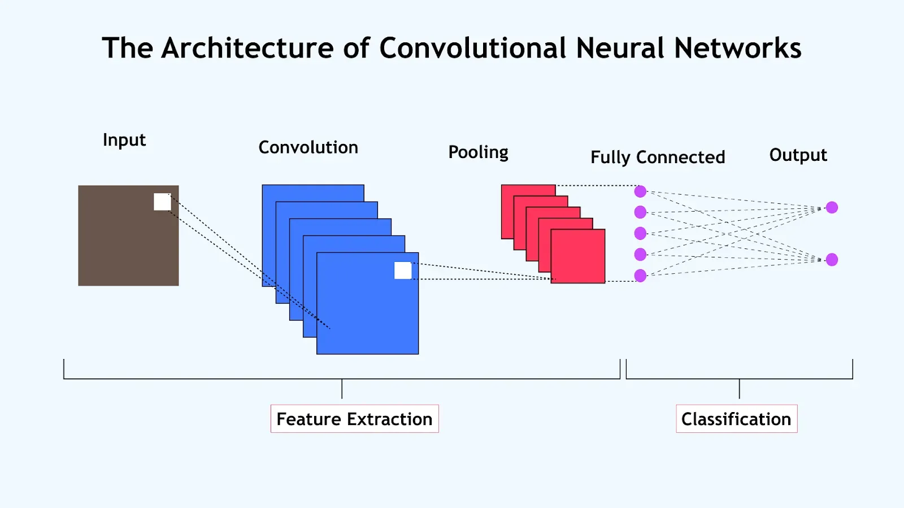

## <mark> 1) Why is deep learning important? Explain with real-world examples. </mark>

### Why Is Deep Learning Important?

**Deep learning** is crucial because it allows computers to learn complex patterns from vast and varied data without human-crafted rules. This has led to remarkably accurate and intelligent systems in fields where traditional methods often fall short.

### Key Reasons for Its Importance

1. **Handles Complex Data:** Deep learning can learn patterns from unstructured data like images, sound, and human language, automating tasks that were once considered uniquely human.
2. **Continual Improvement:** With more data and computing power, deep learning systems keep improving and adapting without manual intervention.
3. **Feature Extraction:** Instead of relying on human experts to define useful features, deep neural networks discover them automatically, improving accuracy and efficiency.

### Real-World Examples of Deep Learning Impact

- **Image Recognition and Computer Vision:**

  - Powers facial recognition in phones, automatic photo tagging, and even autonomous vehicles that can detect pedestrians, traffic signs, and obstacles.[3][5]
  - Medical imaging tools use deep learning to spot early signs of diseases like cancer in MRI and X-ray scans, sometimes surpassing human experts.[5][6][3]

- **Natural Language Processing (NLP):**

  - Virtual assistants like Siri and Alexa understand and respond to voice commands, chatbots provide customer support, and systems summarize long texts into concise insights.[6][3]
  - Translation apps break language barriers in real time.

- **Speech Recognition:**

  - Voice typing, real-time transcription in meetings, and smart home control are possible due to deep learning models that convert speech to text accurately, even across accents and in noisy environments.[3][6]

- **Recommendation Systems:**

  - Streaming services like Netflix and YouTube suggest content tailored to each user, while e-commerce sites recommend products based on browsing and buying patterns.[5][3]

- **Healthcare and Drug Discovery:**

  - AI systems assist doctors in diagnosing diseases, propose effective drug combinations, and accelerate drug discovery, cutting costs and saving lives.[6][3][5]

- **Cybersecurity and Fraud Detection:**

  - Deep learning models flag suspicious activities in banking and online transactions, protecting users from fraud by learning subtle, complex patterns.[6]

- **Smart Cities and Industrial Automation:**
  - Traffic signals are managed dynamically to reduce jams, and industrial robots automate warehouse work and precision manufacturing.[7]

### Summary

Deep learning is important because it powers the technology behind medical breakthroughs, safer transportation, smarter recommendations, robust language tools, and greater automation. Its ability to learn directly from raw data keeps unlocking new possibilities in science, business, and daily life.[1][3][5]

## <mark> 2) Differentiate between structured, unstructured, and semi-structured data with examples. </mark>

### Difference Between Structured, Semi-Structured, and Unstructured Data

Let’s break down the three major data types with definitions and real-world examples:

### 1. Structured Data

- **Definition:** Highly organized data with a fixed schema—fits neatly into rows and columns of tables (often managed by relational databases).
- **Storage:** Databases like SQL, Excel sheets.
- **Examples:**
  - Customer records: Name, Age, Phone Number
  - Bank transactions table
  - Inventory spreadsheets
- **Features:** Easy to search, query, analyze; less flexible and harder to scale.[1][2][3][4][7]

### 2. Semi-Structured Data

- **Definition:** Data that is not stored in rigid tables but still has some organization (often via tags or keys); there is no fixed schema, but structural elements exist.
- **Storage:** NoSQL databases, XML, JSON files.
- **Examples:**
  - XML or JSON documents (e.g., data exported from an app)
  - Emails with metadata (subject, timestamp—structured; body text—less structured)
  - Digital photos with EXIF metadata (image content is unstructured, but tags like date/time/geotag add structure)
- **Features:** More flexible than structured data, easier to scale, but harder to analyze than truly structured data; sits between structured and unstructured forms.[3][5][7][8][1]

### 3. Unstructured Data

- **Definition:** Data with no predefined organization or model—cannot be stored as rows/columns; often qualitative and rich in information.
- **Storage:** Data lakes, filesystems.
- **Examples:**
  - Text documents, social media posts
  - Images, videos, audio files
  - PDF documents, Word files, media logs
- **Features:** Most flexible and scalable; hard to query or analyze directly; often requires advanced processing tools like natural language processing or image recognition.[5][6][7][8][1][3]

### Summary Table

| Type            | Structure Level   | Storage                | Example                |
| --------------- | ----------------- | ---------------------- | ---------------------- |
| Structured      | Fixed, rigid      | SQL, Spreadsheets      | Employee DB table      |
| Semi-Structured | Partial, flexible | JSON, XML, NoSQL       | JSON blog data, emails |
| Unstructured    | None              | Data lakes, filesystem | Tweets, videos, PDFs   |

**In practice:** Most organizations work with all three, often combining survey results (structured), customer emails (semi-structured), and reviews or photos (unstructured) for richer analytics.

## <mark> 3) Draw and explain the architecture of a Convolutional Neural Network (CNN). </mark>

### Architecture of a Convolutional Neural Network (CNN)

A **Convolutional Neural Network (CNN)** is a specialized type of neural network particularly effective for processing image and spatial data. CNNs automatically learn spatial hierarchies of features by using different kinds of layers stacked together in a specific order.

### 1. Input Layer

- Receives the raw data (such as an image). Each pixel forms part of the input vector. For color images, inputs span width, height, and depth (channels).

### 2. Convolutional Layers

- Apply several small filters (kernels) that slide over the input to extract low- to high-level features (edges, textures, shapes).
- Each filter produces a **feature map**: an array highlighting where a specific pattern appears in the input.
- These filters are **learned** automatically during training, allowing the network to detect ever more complex features as you go deeper.[1][3][4]

### 3. Activation Functions

- After each convolution, an activation function (most commonly **ReLU: f(x) = max(0, x)**) introduces non-linearity, helping the network learn complex relationships.[3][5][7]

### 4. Pooling Layers

- Reduce the spatial dimensions (width and height) of the feature maps, keeping the most important information while lowering computation.
- **Max pooling** is common: it selects the maximum value from each patch.
- Helps achieve translation invariance and reduces overfitting.[2][4][7]

### 5. (Optional) Normalization & Dropout Layers

- **Normalization layers:** Standardize activations to improve training stability (e.g., batch normalization).
- **Dropout layers:** Randomly ignore some neurons during training to reduce overfitting.

### 6. Fully Connected (Dense) Layers

- Neurons are connected to all activations in the previous layer.
- Combine and interpret extracted features from earlier layers.
- Near the end of the network.[4][7][2][3]

### 7. Output Layer

- Produces the final predictions (e.g., class scores for classification tasks).
- **Softmax activation** is used for multi-class problems, giving probabilities for each class.[5]

### Typical Flow of Data in a CNN

1. **Input image** →
2. **Convolution + Activation (ReLU)** →
3. **Pooling** →
4. (Repeat Conv+Act+Pool as needed) →
5. **Flatten to 1D** →
6. **Fully Connected layers** →
7. **Output layer (e.g., Softmax for classification)**

**In Summary:**
Convolutional layers extract features; pooling downscales and filters; fully connected layers interpret and classify. CNNs are powerful for image, signal, and spatial data due to their ability to learn patterns at different levels of abstraction.

## <mark> 4) Describe the training methodology of CNN, mentioning forward pass, loss calculation, and backpropagation. </mark>

### Training Methodology of a CNN

Training a Convolutional Neural Network (CNN) involves several key steps, each critical for learning effective patterns from data like images:

### 1. Forward Pass

- The input (e.g., an image) passes sequentially through all CNN layers: convolutional, pooling, flatten, and fully connected layers.
- Each layer applies filters, activations (like ReLU), and transformations, gradually mapping the input data to a meaningful representation.
- The output layer produces predictions, such as class scores for each category.[2][3]

### 2. Loss Calculation

- The network's prediction is compared with the true label using a **loss function** (e.g., cross-entropy for classification).
- The loss function quantifies the error or difference between predicted outputs and actual labels; a smaller loss means better predictions.[5][2]

### 3. Backpropagation

- **Backpropagation** computes the gradients of the loss with respect to each weight and parameter in the network using the chain rule from calculus.
- These gradients are used by an **optimizer** (like SGD or Adam) to update the weights, with the goal of minimizing the loss.
- This step refines the filters and connections so the network improves predictions in the next round.[1][2][5]

### Summary Flow

1. **Forward pass:** Compute predictions.
2. **Calculate loss:** Measure prediction error.
3. **Backpropagation:** Compute gradients and update weights.
4. **Repeat:** Steps 1–3 are repeated with batches of data over many epochs, allowing the CNN to learn from the entire dataset.[1][5]

## <mark> 5) List and briefly describe two state-of-the-art CNN models and their applications. </mark>

### Two State-of-the-Art CNN Models and Their Applications (2025)

### 1. **ConvNeXt**

ConvNeXt is a modernized convolutional neural network inspired by both classic CNNs (like ResNet) and advances seen in transformer architectures. It incorporates larger filter sizes, depth-wise separable convolutions, GELU activations, and improved training techniques (such as AdamW and advanced data augmentation). These updates help ConvNeXt deliver state-of-the-art performance on image classification and other computer vision tasks—recent benchmarks show ConvNeXt outperforming transformer-based Swin-T models on major image recognition datasets.[5]

- **Application Example:** ConvNeXt has been used in advanced visual recognition systems, such as medical imaging for disease diagnosis, automated quality inspection in manufacturing, and next-generation smart cameras.

### 2. **DenseNet121**

DenseNet121 is part of the Densely Connected Convolutional Network (DenseNet) family, which connects each layer to every other layer in a feedforward fashion. This architecture encourages feature reuse and efficient gradient flow, making the network more compact and effective. DenseNet121 has demonstrated high accuracy in visual classification tasks and is especially known for medical image analysis, such as classifying X-rays or MRI scans.[4]

- **Application Example:** DenseNet121 is widely used in healthcare for detecting and diagnosing diseases from imaging data, resulting in improved classification accuracy for conditions like pneumonia, COVID-19, and cancers.

**Summary:** State-of-the-art CNNs like ConvNeXt and DenseNet121 power breakthroughs in computer vision, from healthcare diagnostics to industrial automation, by delivering superior accuracy and efficient computation.

## <mark> 6) Explain the architecture of a Recurrent Neural Network (RNN) for time-series data modeling. </mark>

### Architecture of a Recurrent Neural Network (RNN) for Time-Series Modeling

A **Recurrent Neural Network (RNN)** is uniquely designed for sequential data like time series. Its architecture enables the network to capture temporal patterns and dependencies, making it well-suited for forecasting and modeling sequences such as stock prices, weather data, and sensor measurements.[1][2][4]

### Core Components of RNN Architecture

1. **Input Layer**

   - Receives time-series data, typically as sequences: at each step $$ t $$, the network takes an input value (or vector) $$ x_t $$.

2. **Recurrent Hidden Layer(s)**

   - The heart of an RNN. Each neuron in this layer not only receives the current input $$ x*t $$ but also the **hidden state** from the previous time step ($$ h*{t-1} $$).
   - This structure lets the network retain and "remember" information across the sequence.
   - Variants like **LSTM** and **GRU** cells are often used to solve standard RNNs' problems with long-term dependencies.[2][4][5]

3. **Output Layer**
   - Produces the prediction for each time step (can be one output for the whole sequence, or per step). For example, to predict the next value in a sequence, the output layer receives the hidden state and transforms it into a forecasted value.

### Data Flow in an RNN (For a Sequence of Length T)

At each time step $$ t $$:

- **Input**: Receives $$ x_t $$
- **Hidden State Update**: Combines the input $$ x*t $$ and previous hidden state $$ h*{t-1} $$ to compute the new $$ h_t $$:
  $$
    h_t = f(W_{xh} x_t + W_{hh} h_{t-1} + b)
  $$
  Where:
  - $$ f $$ is a nonlinear activation function (often tanh or ReLU)
  - $$ W*{xh}, W*{hh} $$ are weight matrices
  - $$ b $$ is bias
- **Output**: Optionally, each step may also produce an output $$ y_t $$.

### Why RNNs Excel at Time-Series Modeling

- **Sequential Memory**: The recurrent structure lets RNNs learn relationships that depend on previous time steps, such as trends, seasonality, and patterns in time series.[1][2]
- **Flexible Inputs**: RNNs handle variable-length input sequences, making them ideal for real-world time-series data.
- **Extendable**: Variants like LSTM and GRU enable RNNs to capture long-term dependencies and mitigate vanishing/exploding gradients. Advanced architectures can also integrate attention mechanisms or hybrid with CNNs.[4][5][2]

### Real-World Example

Suppose
you're modeling daily sales: each day's sales plus the previous days' hidden state are used by the RNN to predict the next day's sales. The RNN 'remembers' recent sales patterns to produce better forecasts.

## <mark> 7) Compare RNN and LSTM architectures, highlighting the advantages of LSTM. </mark>

### RNN vs LSTM: Architecture Comparison and LSTM Advantages

### Basic RNN Architecture

- **Structure:** RNNs process sequential data by looping information (hidden state) from one step to the next. Each step takes the current input and previous hidden state to compute a new hidden state and output.
- **Strengths:** Good for short-term dependencies and quick pattern recognition.
- **Limitations:** Struggle with preserving information over long sequences due to the **vanishing gradient problem**—gradients become too small to update weights, so learning long-term patterns fails.[1][2][3]

### LSTM (Long Short-Term Memory) Architecture

- **Structure:** LSTMs are a special type of RNN designed to remember information over much longer sequences. Each LSTM cell includes:
  - **Memory Cell:** Maintains information over many steps.
  - **Input Gate:** Controls which new information enters the memory.
  - **Forget Gate:** Controls which old information should be removed.
  - **Output Gate:** Decides what part of the cell memory moves to the output.
- **Strengths:** The gating mechanisms allow LSTMs to retain important information and forget irrelevant details, thus capturing long-term dependencies in data.[2][3][6][1]
- **Limitations:** LSTMs are more complex (more parameters and computations) and thus can be slower to train and require more memory compared to basic RNNs.[5]

### Key Advantages of LSTM over RNN

- **Remembers Long-Term Patterns:** LSTMs can capture long-range dependencies better by mitigating the vanishing gradient problem; basic RNNs quickly "forget" earlier sequence data.[3][1][2]
- **Selective Memory:** With input, forget, and output gates, LSTMs decide what to remember, update, and forget, allowing for better handling of noisy or irrelevant information.
- **Better Real-World Performance:** LSTMs outperform RNNs in tasks like language modeling, machine translation, and speech recognition, where context from many steps in the past is crucial.[1][3]

### Summary Table

| Feature                  | RNN                     | LSTM                                      |
| ------------------------ | ----------------------- | ----------------------------------------- |
| Memory Mechanism         | Simple hidden state     | Cell state plus input/forget/output gates |
| Long-term Dependency     | Poor                    | Excellent                                 |
| Vanishing Gradient Issue | Common                  | Rare (well-mitigated)                     |
| Complexity/Parameters    | Fewer, simpler          | More, higher memory/computation           |
| Typical Use-Cases        | Short-sequence modeling | Language, translation, time-series        |

## <mark> 8) Explain the working principle of an autoencoder for unsupervised learning. </mark>

### Working Principle of an Autoencoder for Unsupervised Learning

An **autoencoder** is a type of neural network designed to learn efficient representations of data in an **unsupervised** manner—meaning it does not use labeled outputs during training. Here is how it works step by step:[3][6]

### 1. **Architecture Overview**

Autoencoders consist of three main parts:

- **Encoder:** Compresses the input data into a reduced, lower-dimensional representation (latent space or bottleneck). This step captures only the most important features and removes redundancy or noise.
- **Bottleneck (Latent Space):** The narrowest part of the network, storing the compact representation. Encoding data here forces the network to focus on essential features.
- **Decoder:** Reconstructs the original data from this compressed form, expanding it back to the original size and structure.

### 2. **Training Process**

- The input is first passed through the **encoder**, yielding the compressed (latent) code.
- The **decoder** then uses this code to reconstruct the input.
- The network is trained to minimize the **reconstruction error**—the difference between the original input and the reconstructed output (often using Mean Squared Error).[6]
- Weights of both encoder and decoder are updated so that the autoencoder produces reconstructions as close as possible to the original data.

### 3. **Key Points**

- **Unsupervised Learning:** Autoencoders don’t require labeled data; they “supervise” themselves by trying to match their output to their own input.
- **Feature Extraction & Dimensionality Reduction:** By learning to faithfully compress and reconstruct inputs, autoencoders extract meaningful and useful features—even from noisy or redundant data.[4][5]

### 4. **Applications**

- Data denoising, anomaly detection, dimensionality reduction, and as a pretraining step for deep learning tasks.

**Quick Recap:** You feed data in, the encoder compresses it, the decoder reconstructs it, and the network learns by minimizing the error between input and output—all without ever needing labeled outputs.

## <mark> 9) </mark>
