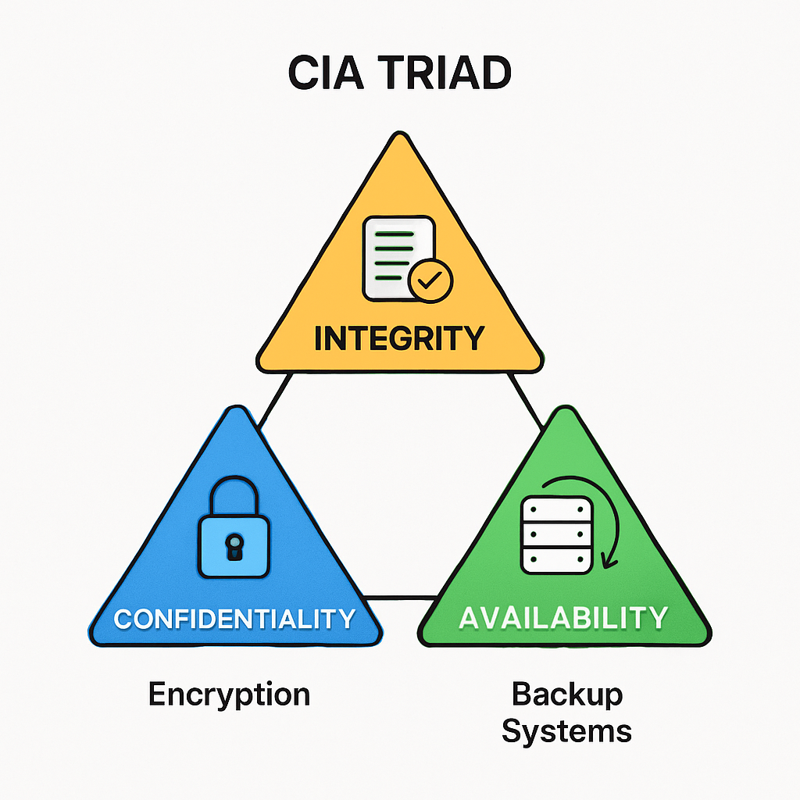

## <mark> 1) Define Cyber Security. Why is it important in today’s world? </mark>

### Definition of Cyber Security

Cyber Security is the practice of **protecting computers, networks, devices, and data** from unauthorized access, attacks, or damage caused by various cyber threats such as hacking, malware, and phishing. It involves using technologies, processes, and best practices to defend digital assets and ensure the confidentiality, integrity, and availability of information.

### Importance in Today’s World

Let’s unpack _why Cyber Security matters so much now._

1. **Pervasive Technology Use:** Nearly everything—from banking to healthcare and government—relies on digital systems. Attacks can disrupt daily life or critical infrastructure.
2. **Data Explosion:** Vast amounts of sensitive personal and business data are exchanged and stored online, making them targets for exploitation and theft.
3. **Increasing Sophistication of Attacks:** Cyber attackers continuously develop newer and more advanced methods, making even strong systems vulnerable.
4. **Financial and Personal Risk:** A cyber breach can cause financial loss, reputational harm, and exposure of confidential information.
5. **Global Connectivity:** The rise in connected devices, remote work, and cloud services means threats aren’t limited by geography—they’re global and always evolving.

In short: **Cyber Security is crucial for safeguarding information, enabling trust, and ensuring smooth, secure operations** in our increasingly digital society.

### Quick Recall Tip

Remember the “CIA Triad” — **Confidentiality, Integrity, Availability** — to quickly recall the core goals of cyber security. Can you briefly explain why each part matters?

## <mark> 2) List and explain the challenges in implementing Cyber Security. </mark>

### Challenges in Implementing Cyber Security

Let's break down key challenges organizations face:

### 1. **Sophistication of Cyber Attacks**

Attackers constantly upgrade their tactics, using complex methods like Advanced Persistent Threats and ransomware that can evade detection for long periods and cause severe harm. Modern attacks often involve multi-stage strategies and target critical operations.

### 2. **Human Error**

People are often the weakest link—poor password management, falling for phishing, or carelessly sharing sensitive data make systems vulnerable. Training helps, but mistakes still happen frequently.

### 3. **Rapidly Evolving Technology**

Emerging technologies (like IoT and cloud computing) expand the attack surface. Many new devices lack built-in security, making them easy targets, while cloud services bring unique vulnerabilities such as misconfigured storage.

### 4. **Third-Party and Supply Chain Risks**

Organizations rely on external vendors, partners, or open-source software. If these have weak security, one breach can cascade through many connected networks, impacting multiple companies.

### 5. **Shortage of Skilled Professionals**

There's a global gap in cybersecurity expertise. Without enough trained personnel, organizations struggle to detect, respond to, and recover from sophisticated attacks.

### 6. **Legacy and Edge Devices**

Old systems and new "edge" devices often aren't built for modern security needs. Legacy software may lack updates, and edge devices create additional vulnerable points that are hard to monitor.

### Summing Up

Cyber security is tough to implement because attacks are getting smarter, technology and devices keep changing, people make mistakes, supply chains are complex, and skilled experts are in short supply. Focusing on **training, technology upgrades, vendor assessments, and recruiting skilled teams** helps mitigate these risks.

## <mark> 3) What is Cyberspace? Discuss its characteristics. </mark>

### Definition of Cyberspace

Cyberspace is a **virtual and dynamic domain** created by interconnected computer networks and digital systems where people interact, communicate, share information, and perform activities. It is an immaterial space formed by digital networks, the internet, systems, and data, existing beyond physical boundaries and geographic locations.

### Characteristics of Cyberspace

- **Borderless:** Unlike physical spaces with geographic limits, cyberspace transcends national borders, enabling instantaneous global connectivity and cooperation but also creating unique challenges in cybersecurity and governance.
- **Dynamic:** Cyberspace constantly evolves due to technological innovations, user activity, and legal frameworks. It is continuously changing, requiring ongoing updates and responses to new threats and technologies.

- **Accessible:** Anyone with internet access can enter cyberspace, providing widespread availability of information and digital services. However, access can be limited by infrastructure, social factors, or government restrictions.

- **Anonymous:** Users in cyberspace can often remain anonymous, which can protect privacy but also facilitates cybercrime and misuse of the digital environment.

- **Virtual Environment:** It is a computer-generated space with no physical mass, representing abstract data and digital interactions.

- **Interconnected:** It consists of countless networks, devices, and platforms connected globally, enabling seamless communication and information exchange.

In essence, cyberspace is the intangible global digital environment that underpins much of today’s communication, commerce, education, and governance, shaping the modern world.

## <mark> 4) Differentiate between Cyber threats and Cyberwarfare with examples. </mark>

### Difference Between Cyber Threats and Cyberwarfare

| Aspect                      | Cyber Threats                                                                                                                          | Cyberwarfare                                                                                                                               |
| --------------------------- | -------------------------------------------------------------------------------------------------------------------------------------- | ------------------------------------------------------------------------------------------------------------------------------------------ |
| Definition                  | Potential or actual attempts by hackers or malicious actors to gain unauthorized access, harm, or steal data from networks or systems. | State-sponsored cyber attacks aimed at disrupting, damaging, or sabotaging another nation’s critical infrastructure or government systems. |
| Motivation                  | Usually for financial gain, personal data theft, or disruption.                                                                        | Political, military, or strategic national interests.                                                                                      |
| Attackers                   | Individuals, organized cybercriminal groups, or hacktivists.                                                                           | Nation-states or state-sponsored actors.                                                                                                   |
| Targets                     | Businesses, individuals, financial institutions, and governments.                                                                      | Governments, military systems, critical national infrastructure.                                                                           |
| Examples                    | Phishing, ransomware attacks, malware infections.                                                                                      | Stuxnet virus attack on Iran’s nuclear facilities (2010), Russian cyberattacks on Ukrainian power grids.                                   |
| Scale and Impact            | Can be limited or wide but mostly financial or data loss focused.                                                                      | Large scale causing national security threats, infrastructure disruption, or even loss of life.                                            |
| Legality and Accountability | Cyber threats typically fall under criminal law enforcement.                                                                           | Cyberwarfare is part of geopolitical and military conflict, often governed by international laws of warfare.                               |

### Summary

Cyber threats represent the broad category of hostile cyber actions primarily aimed at financial or data damages by non-state actors. Cyberwarfare is a specialized, state-sponsored form of attack designed to harm national security, infrastructure, and sovereignty in a digital context.

Examples clearly distinguish the two: common cyber threats include malware and phishing attacks, whereas cyberwarfare includes sophisticated operations like Stuxnet and politically motivated state attacks impacting countries on a large scale.

## <mark> 5) Explain the CIA Triad with neat diagram and examples. </mark>

### CIA Triad Explanation with Examples

The CIA Triad stands for **Confidentiality, Integrity, and Availability**—the three foundational principles of cybersecurity that aim to protect information and systems.

### 1. Confidentiality

- **Definition:** Ensures that sensitive information is accessible only to authorized users and prevents unauthorized access or disclosure.
- **Example:** Using strong passwords, multi-factor authentication (like a code sent to a phone), and encryption (e.g., HTTPS for websites) to protect user data from hackers.

### 2. Integrity

- **Definition:** Maintains the accuracy, consistency, and trustworthiness of data by preventing unauthorized modification or tampering.
- **Example:** Digital signatures and hashing ensure that financial transaction records or software updates haven’t been altered during transmission or storage.

### 3. Availability

- **Definition:** Guarantees that information and resources are available and accessible to authorized users whenever needed.
- **Example:** Using backup systems, load balancing, and defense against DDoS attacks to ensure that an e-commerce website remains accessible during high traffic or cyberattacks.

Together, the CIA Triad provides a balanced security approach ensuring data stays private (Confidentiality), reliable (Integrity), and accessible (Availability) for users and organizations.

## <mark> 6) What is Cyber Terrorism? Give suitable examples. </mark>

### Cyber Terrorism Definition

Cyber Terrorism refers to **the use of the internet and digital technology by terrorist groups or individuals to carry out violent acts** that cause or threaten loss of life, significant damage, or disruption with the aim of achieving political, religious, or ideological objectives. These acts involve attacks on computer systems, networks, or critical infrastructure to create fear, panic, or intimidation among populations or governments.

### Examples of Cyber Terrorism

- **Disruption of National Power Grids:** Attackers targeting power infrastructure to cause widespread blackouts, paralyzing cities or countries.
- **Ransomware Attacks on Critical Infrastructure:** Holding a hospital’s or government’s systems hostage to extort money or exert political pressure.
- **Website Defacement or Propaganda:** Terrorist groups hacking websites to spread extremist messages or misinformation.
- **Denial of Service (DoS) Attacks:** Overwhelming government or emergency services websites to hinder communication and response.
- **Stuxnet Attack (Though often considered cyberwarfare):** A sophisticated malware targeting Iran's nuclear facilities, causing physical disruption.

Cyber terrorism differs from general cybercrime because it aims to **cause terror and influence political or social outcomes**, often threatening safety and security on a broader scale.

## <mark> 7) Explain the importance of Cyber Security for Critical Infrastructure (like power grids, transport, banking, etc.). </mark>

### Importance of Cyber Security for Critical Infrastructure

Critical infrastructure—such as **power grids, transportation systems, banking, water supply, and healthcare**—forms the backbone of modern society. Protecting these vital systems from cyber threats is essential for several reasons:

### 1. **Public Safety and Continuity**

- Attacks on systems like power grids or hospitals can threaten public safety. Disrupted infrastructure can cause blackouts, impact emergency services, or prevent access to critical medical care.

### 2. **Economic Stability**

- Financial institutions and transport networks are central to economic activity. Cyberattacks can halt transactions, disrupt supply chains, and result in major financial losses.

### 3. **National Security**

- Critical infrastructure is often a target for state-sponsored cyberwarfare and terrorism. Disruptions can affect military operations, government functioning, and national defense mechanisms.

### 4. **Resilience Against Threats**

- Robust cybersecurity defends against a wide range of threats: hackers, criminal gangs, insider threats, and even physical disasters that could be worsened by digital attacks.

### 5. **Prevention of Cascading Failures**

- Infrastructure systems are interconnected. A cyberattack on one (like the energy grid) can ripple through others (transport, communications, banking), magnifying the impact.

### 6. **Protection against Cybercrime and Espionage**

- Attackers target critical data and control systems for ransom, theft, or espionage. Security measures protect from financial losses and information theft.

### **Real World Example**

In May 2021, the Colonial Pipeline in the U.S. was hit by a cyberattack using a compromised password, causing widespread fuel shortages and millions in ransom payments—highlighting how essential strong cybersecurity is for critical systems.

**In summary:** Without effective cybersecurity, critical infrastructure faces risks of disruption, economic loss, public harm, and national insecurity. Safeguarding these systems is vital to keep society functioning smoothly in the digital age.

## <mark> 8) Discuss the organizational implications of Cyber Security. </mark>

### Organizational Implications of Cyber Security

Cyber security has far-reaching implications for organizations encompassing operational, financial, legal, and reputational aspects, including:

### 1. Financial Impact

Cyber attacks can cause significant **financial losses** due to:

- Theft or loss of sensitive data
- Business disruption and downtime
- Costs associated with investigation, recovery, and system restoration
  Estimated costs of cybercrime for organizations can range from hundreds of thousands to millions of dollars depending on attack severity.

### 2. Operational Disruption

Cyber incidents often cause **business disruption**, interrupting normal operations, halting production or service delivery, and reducing productivity. This can affect an organization’s ability to meet customer demands or contractual obligations.

### 3. Data Loss and Intellectual Property Risks

Loss or theft of intellectual property (IP) and sensitive data damages competitive advantage and trust. Organizations must protect proprietary research, customer information, and confidential records to avoid legal and market consequences.

### 4. Legal and Compliance Issues

Organizations face strict regulations and compliance requirements (such as GDPR, HIPAA, ISO 27001) regarding data protection. Failure to comply due to security breaches results in legal penalties, lawsuits, and increased scrutiny.

### 5. Reputational Damage

A cyber breach can harm brand credibility and customer trust, leading to long-term loss of business and competitive position. Organizations must protect their digital reputation by maintaining robust cybersecurity.

### 6. Need for Skilled Cybersecurity Workforce

Organizations must invest in dedicated cybersecurity teams responsible for threat detection, risk assessment, incident response, identity and access management, and infrastructure protection. Building this expertise can be costly but essential.

### 7. Change in Organizational Processes and Culture

Cybersecurity requires integrating security into organizational policies, employee training, operational workflows, and corporate governance—from leadership down to individual users—promoting a security-first mindset.

### Summary

For organizations, cybersecurity is not just about technology but involves comprehensive management of risks to **financial health, operations, compliance, reputation, and human resources**. Proactive security governance helps organizations survive and thrive in an increasing digital threat landscape.

## <mark> 9) Short notes:   (a) Cyberwarfare   (b) Cyber Terrorism   (c) Critical Infrastructure Protection </mark>

### (a) Cyberwarfare

Cyberwarfare is the use of cyber attacks by a nation-state or organized groups to conduct aggressive and strategic operations against another country or entity. Its goals include disrupting, damaging, or gaining control over critical infrastructure, military systems, or government networks to achieve political, military, or economic advantages. Examples include the Stuxnet virus attack on Iran’s nuclear facilities and the NotPetya ransomware attack attributed to Russia. Cyberwarfare can involve espionage, sabotage, denial-of-service attacks, and ransomware aimed at crippling an adversary’s critical systems.

### (b) Cyber Terrorism

Cyber terrorism involves the use of internet-based attacks by terrorist groups to cause disruption, fear, or harm with political, religious, or ideological motives. It targets critical infrastructure such as power grids, transport, and government systems to create terror and destabilize societies. Examples include ransomware attacks on hospitals or disruption of national power supplies aimed at causing panic and damage. Unlike general cybercrime, cyber terrorism seeks to influence or intimidate populations or governments.

### (c) Critical Infrastructure Protection

Critical Infrastructure Protection (CIP) refers to measures and strategies to safeguard vital systems such as power grids, transportation, banking, water supply, and healthcare from cyber threats and attacks. Protecting these infrastructures is crucial because their disruption can endanger public safety, cause economic losses, and threaten national security. Effective CIP involves risk assessment, deploying cybersecurity technologies, contingency planning, and ensuring compliance with regulations to maintain operational continuity and public trust.

These summaries highlight the strategic importance and broad impact of cyber-related activities on national security and societal functioning.
