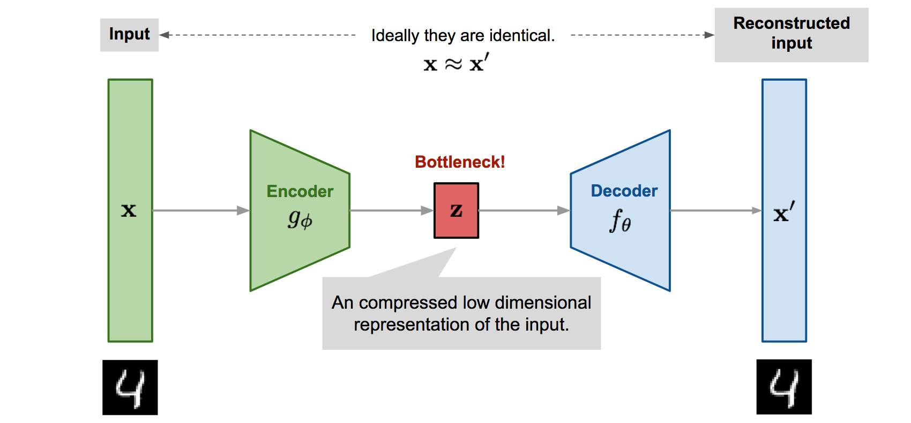

## <mark> 1) Explain the working principle of a Variational Autoencoder (VAE) with a block diagram. </mark>

### Working Principle of a Variational Autoencoder (VAE)

A **Variational Autoencoder (VAE)** is a powerful _generative_ model that learns not just to compress input data, but to represent it in a continuous, probabilistic latent space. This allows the VAE to generate new, realistic data samples by sampling from the learned distribution.

### **Main Components of VAE**

1. **Encoder**: Maps input data (like images) to two vectors — a mean ($$\mu$$) and a standard deviation ($$\sigma$$). These define a probability distribution over the latent space for each input, rather than a single point.

2. **Sampling/Reparameterization**: Instead of encoding as a fixed point, VAEs sample a random point $$z$$ from this learned distribution (using $$\mu$$ and $$\sigma$$), which adds controlled randomness. This step uses the **reparameterization trick** — sampling $$z = \mu + \sigma \cdot \epsilon$$, with $$\epsilon \sim N(0,1)$$, so backpropagation works correctly.

3. **Decoder**: Takes the sampled point from the latent space and attempts to reconstruct the original input, learning to generate realistic examples from different points in the latent space.

### **Training Objective**

The VAE is trained to:

- **Minimize reconstruction loss**: Ensuring the decoded output matches the original input (just like a normal autoencoder).
- **Minimize KL divergence**: Encouraging the learned latent distribution to be close to a known simple distribution (like a standard normal), allowing smooth sampling and generation.

### VAE Block Diagram

**Summary:**

- The **encoder** outputs parameters (mean & variance) for a distribution over the latent space.
- A random vector is sampled (via reparameterization) from this space.
- The **decoder** reconstructs data from this sampled point.
- VAEs can both recreate inputs and generate new, similar samples — making them useful for data generation, anomaly detection, and more.

## <mark> 2) What is a Generative Adversarial Network (GAN)? Explain its generator and discriminator components. </mark>

### What is a Generative Adversarial Network (GAN)?

A **Generative Adversarial Network (GAN)** is a deep learning model designed to generate new, realistic data samples by learning from a training dataset. GANs are notable for their two-part architecture: the **generator** and the **discriminator**, which are trained together in an adversarial process.

### Components of a GAN

#### 1. **Generator**

- The **generator** is a neural network that takes random input (usually noise) and transforms it into synthetic data (like images, text, or sound) that mimic the real data distribution.
- Its goal is to **"fool"** the discriminator by producing data samples that appear indistinguishable from genuine ones.
- The generator learns by receiving feedback from the discriminator—if the discriminator spots a fake, the generator updates its parameters to improve future outputs.

#### 2. **Discriminator**

- The **discriminator** is another neural network that receives both real data (from the actual dataset) and fake data (from the generator).
- Its job is to correctly classify each sample as real or fake, outputting a probability score close to 1 for real data and 0 for generated data.
- Through training, it gets better at identifying fakes and provides a learning signal to the generator.

### How GANs Work (Training Process)

1. **Generate**: The generator produces new data samples from random noise.
2. **Discriminate**: The discriminator evaluates real data and generated data, giving each a probability of being real.
3. **Adversarial training**: The generator seeks to improve its outputs to fool the discriminator, while the discriminator learns to get better at detecting fakes.
4. **Equilibrium**: Ideally, the process continues until the generator's fake data is so convincing that the discriminator can no longer reliably distinguish real from generated samples—at this point, the generator can produce highly realistic data.

**Summary:**

- The **generator** creates fake data; the **discriminator** judges if data is real or fake.
- Both networks compete and improve together, making GANs powerful tools for data generation, image synthesis, style transfer, and more.

## <mark> 3) Describe the concept of diffusion models for high-quality image generation. </mark>

### Diffusion Models for High-Quality Image Generation

**Diffusion models** are a class of generative AI models that create high-quality images by learning to reverse the physical process of diffusion—that is, they start with random noise and gradually recover data structure, producing realistic images step by step.

### Core Concept

1. **Forward Diffusion (Noising):**
   - The process begins by taking a real image and _systematically adding small amounts of Gaussian noise_ over many steps until the image becomes pure noise. The progression is formulated as a Markov chain, with each step introducing a little more noise. No neural network is involved at this stage.
2. **Reverse Diffusion (Denoising):**
   - A neural network (typically a UNet with attention) is trained to _remove noise step-by-step_. Starting from pure noise, the model repeatedly denoises the image through many iterations, each time producing an image that's a little less noisy and eventually reconstructs a realistic, detailed image.

### Training & Generation Workflow

- During training, the model learns to predict the noise that was added to an image at a given step and how to remove it, using losses like Mean Squared Error (MSE).
- During generation (inference), the model starts with pure noise and successively applies its learned denoising steps, revealing more structure at each iteration until a realistic image emerges.

### Why Are Diffusion Models Powerful?

- **Stability:** Because the model only needs to learn to remove a little noise at each step, training is often more stable than with models like GANs, which must generate an image in a single leap.
- **Quality:** Diffusion models can produce state-of-the-art, high-fidelity images, matching or surpassing GANs in detail and realism.
- **Flexibility:** They have been successfully used for text-to-image systems (e.g., DALL-E 2, Stable Diffusion), inpainting, super-resolution, and more.

### Real-World Analogy

- Imagine adding small random movements to the pixels of a photo repeatedly until it becomes static TV noise. The diffusion model learns how to _reverse this process_, step by step, reconstructing the picture from random pixels.

### Visual Progression (Description)

- Early denoising steps show blurry or static-like images, which gradually gain sharper features and structure; after enough steps, the image becomes clear and highly detailed.

**In summary:** Diffusion models create images by methodically reversing a noise process, learning to denoise stepwise to deliver high-quality, realistic outputs.

## <mark> 4) Explain transfer learning and give an example where it improves performance. </mark>

### What is Transfer Learning?

**Transfer learning** is a machine learning technique where a model trained on one task is repurposed or fine-tuned for a new, but related, task. Instead of training a model from scratch, transfer learning leverages the knowledge (features, patterns, or representations) already learned from a large dataset and applies it to a new, possibly smaller, dataset—often resulting in better performance, faster training, and requiring much less data.

### Why Is Transfer Learning Useful?

- **Performance Boost:** Pre-trained models bring over general features learned from large datasets, helping new models adapt quickly and accurately to their specific tasks—especially when labeled data are limited.
- **Efficiency:** Saves time and computational resources, as the model doesn’t start learning from zero but from a well-informed starting point.
- **Reduced Overfitting:** Leveraging knowledge from the base model (source task) helps prevent overfitting, particularly useful for small or domain-specific datasets.

### How Does It Work (Typical Workflow)?

1. **Start with a Pre-trained Model:** Use a model trained on a large dataset (for example, ImageNet for images).
2. **Transfer Layers:** Choose which layers to “freeze” (not update) and which to fine-tune. Typically, early layers are frozen (as they contain general features); the final layers are retrained for the new task.
3. **Fine-tuning:** Train the model on the new, target dataset, updating only the chosen layers to adapt the model to the new task.

### Real-World Example: Transfer Learning in Medical Imaging

Suppose doctors want to detect a rare disease from X-ray images, but there are only a few hundred labeled X-rays. Training a deep neural network from scratch would cause overfitting and poor accuracy.

- **Instead,** a deep CNN pretrained on millions of general images (like animals, objects, landscapes) is taken as a starting point.
- The model is then fine-tuned using the X-ray images, updating the final layers to recognize disease-specific features.
- **Result:** The model learns to detect the disease with far higher accuracy and less data than manual training from scratch would allow.

**In summary:** Transfer learning lets you use existing mathematical "know-how" from a model trained on a large task and quickly adapt it to a new, related problem—often leading to better speed, accuracy, and efficiency.

## <mark> 5) Differentiate between pre-training and fine-tuning in deep learning models. </mark>

### Difference Between Pre-Training and Fine-Tuning in Deep Learning

**Pre-training** and **fine-tuning** are two complementary stages in developing deep learning models, especially large language or vision models.

### Pre-Training

- **Purpose:** To learn general features, representations, and patterns from a massive and diverse dataset—often unlabeled or weakly labeled.
- **Process:** The model starts with randomly initialized parameters and is trained for a long time (often weeks or months) on tasks like predicting masked words (for language) or general visual features (for images), using techniques like unsupervised or self-supervised learning.
- **Data:** Large, diverse, and usually unlabeled datasets (e.g., Wikipedia, Common Crawl, ImageNet).
- **Outcome:** Creates a general-purpose model that understands broad language or visual knowledge, capable of being adapted to many tasks.
- **Resource Needs:** Highly resource-intensive, requiring significant computational power and time.

### Fine-Tuning

- **Purpose:** To specialize the pre-trained model for a specific domain or task (e.g., medical text, customer service chatbots, sentiment analysis).
- **Process:** The pre-trained model's parameters are loaded and then further trained ("fine-tuned") on a much smaller, labeled, and often domain-specific dataset, using supervised learning.
- **Data:** Smaller, labeled, task-specific datasets.
- **Outcome:** Model adapts its general knowledge to excel at the target application, achieving higher precision and relevance.
- **Resource Needs:** Moderately resource-intensive; much faster and less demanding than pre-training.

### Summary Table

| Stage        | Goal                                | Data Type        | Example Task                            | Resource Need |
| ------------ | ----------------------------------- | ---------------- | --------------------------------------- | ------------- |
| Pre-training | Learn broad, generalizable features | Large, unlabeled | Learn grammar, vision, world knowledge  | High          |
| Fine-tuning  | Adapt to specific task/domain       | Small, labeled   | Sentiment analysis, diagnosis, chatbots | Moderate      |

**In essence:** Pre-training gives a model broad, reusable capabilities; fine-tuning customizes it for specialized tasks, making both stages crucial for building effective deep learning systems.

## <mark> 6) Explain model optimization techniques in deep learning with examples. </mark>

### Model Optimization Techniques in Deep Learning

Optimization in deep learning not only refers to **finding the best model parameters** during training, but also to making models efficient for deployment and inference. Here are key categories and examples with their roles:

### 1. Optimizers (Training Optimization)

- These algorithms adjust a model’s weights and biases to minimize the loss function effectively.
- Common examples:
  - **Stochastic Gradient Descent (SGD):** Updates parameters using the gradient of the loss on mini-batches for efficiency.
  - **Adam:** Combines momentum and adaptive learning rates for faster convergence and stability in deep networks.
  - **RMSProp and AdaGrad:** Adapt learning rates for each parameter, improving training especially on sparse data.
- Example: Training a CNN for image classification with Adam can lead to faster, more stable convergence than with plain SGD.

### 2. Hyperparameter Tuning

- Hyperparameters (like learning rate, batch size, or network depth) are set before training and majorly affect model performance.
- Grid search, random search, and Bayesian optimization are common techniques for tuning.
- Example: Using Optuna to search for the best learning rate and batch size for a language model can dramatically boost test accuracy.

### 3. Model Compression (Pruning & Quantization)

- **Pruning:** Removes less important weights or neurons, reducing size and accelerating inference. E.g., pruning small-weight connections in a ResNet results in a smaller, faster model with similar accuracy.
- **Quantization:** Converts weights from 32-bit floats to lower-precision formats (e.g., 8-bit integers), shrinking memory needs and improving speed. Used in deploying neural networks on mobile devices and edge hardware.

### 4. Knowledge Distillation

- A large, accurate "teacher" model trains a smaller "student" model to match its outputs, compressing knowledge into a faster model with high accuracy.
- Example: GPT models distilled into smaller versions for chatbots on smartphones.

### 5. Fine-Tuning and Transfer Learning

- Pre-trained models are adapted (fine-tuned) to new tasks/datasets, saving time and boosting specific performance.
- Example: A pre-trained vision model fine-tuned on X-ray images helps quickly deploy accurate diagnostic tools in medicine.

### 6. Parameter-Efficient Fine-Tuning (PEFT)

- Only a small subset of the full model’s parameters are trained while the rest stay frozen, reducing memory and compute needs.
- Example: LoRA and QLoRA allow rapid domain adaptation of large language models for industry applications.

### 7. Gradient Accumulation

- Gradients are accumulated over several small batches before updating weights, mimicking a larger batch size when memory is limited.
- Example: Training deep transformers on limited-GPU machines using mini-batches but achieving stable training as if using large batches.

**Summary:**
Model optimization in deep learning involves improving training (with advanced optimizers and tuning), shrinking models for deployment (pruning, quantization, distillation), and efficient adaptation (fine-tuning, PEFT, and gradient tricks). Real-world use: Quantized, pruned, or distilled models speed up AI on smartphones, and fine-tuned large models enable expert AIs in specialized domains.

## <mark> 7) What is knowledge distillation? Explain teacher-student model architecture. </mark>

### What is Knowledge Distillation?

**Knowledge distillation** is a model compression technique in deep learning where a large, powerful "teacher" model transfers its learned knowledge to a smaller and simpler "student" model. The goal is for the student to closely match the performance of the teacher—particularly its predictions—while being much more efficient in terms of speed and memory, making it suitable for deployment on devices with limited resources.

### Teacher-Student Model Architecture

- **Teacher Model:**

  - A large, accurate, and often complex neural network (sometimes an ensemble or a model with many layers and parameters) trained on labeled data.
  - Produces "soft labels"—probability distributions over possible outputs that carry richer information than just right/wrong answers.

- **Student Model:**
  - A smaller, lighter neural network.
  - Trained to mimic the teacher by minimizing the difference between its own outputs and the teacher's "soft labels" (and sometimes also the actual hard labels).
  - Can use any architecture—does not have to exactly match the teacher.

**How It Works:**

1. The teacher model is first trained to be highly accurate on a dataset.
2. The student model is then trained. During this process, it tries to predict outputs that closely resemble the teacher's predictions—not just the ground-truth labels, but the full probability distributions over output classes (soft labels). This imparts more nuanced knowledge, such as the relationships between classes, to the student.

**Benefits:**

- The student model runs faster, uses less memory, and is easier to deploy, but still achieves performance close to that of the larger teacher model.
- Makes high-quality AI accessible for mobile phones, embedded systems, and other edge devices.

**Example:**
In computer vision, a deep teacher model might achieve state-of-the-art accuracy for object recognition, but is too slow for real-time use on smartphones. Through knowledge distillation, a much smaller student model can be trained to mimic the teacher, making it practical for mobile deployment with little loss in accuracy.

## <mark> 8) Explain the training methodology for model distillation. </mark>

### Training Methodology for Model Distillation

**Knowledge distillation** involves transferring a large teacher model's knowledge to a smaller student model to achieve similar performance with greater efficiency. Here’s how the training methodology typically works:

### 1. Train the Teacher Model (Offline Distillation)

- First, a large and accurate teacher model (such as ResNet, BERT, etc.) is trained on labeled data using standard supervised learning techniques.
- Once trained, the teacher's parameters are frozen, and it is used to guide the student model.

### 2. Generate Soft Labels Using the Teacher

- The teacher processes input data and produces output probabilities ("soft labels"), which represent the teacher's confidence across all classes—not just the correct class.
- These soft labels capture subtle relationships between classes and carry richer information than hard labels (one-hot labels).

### 3. Train the Student Model

- The (smaller) student model is initialized and trained to mimic the teacher. Its loss has two main components:
  - **Hard label loss:** The student learns to predict the correct target class, using the true labels.
  - **Soft label loss:** The student tries to match the teacher's soft output probabilities.
- Typically, a temperature parameter is used to "soften" the probability distributions, making them more informative for learning nuanced distinctions.
- The combined loss function encourages the student to learn both the direct targets and the nuanced decision boundaries learned by the teacher.

### 4. Types of Distillation Training

- **Offline distillation (most common):** Teacher is pre-trained and fixed while student learns.
- **Online distillation:** Teacher and student are trained together in real-time, with mutual updates.
- **Self-distillation:** The student learns from its own deeper layers or previous versions, not a separate teacher.

### 5. Distillation Variants

- **Adversarial distillation:** Incorporates ideas from GANs, training student and teacher with adversarial objectives.
- **Multi-teacher distillation:** Knowledge is distilled from multiple teachers for richer guidance.
- **Feature and relation-based distillation:** Student also learns intermediate representations or inter-sample relationships, beyond just output responses.

**Quick Summary:**

1. Train a big teacher model.
2. Use the teacher to generate informative soft targets.
3. Train the student on both hard labels and soft teacher outputs, often with a special loss function and temperature scaling.
4. Choose offline, online, or self-distillation methods depending on resources and data characteristics.

## <mark> 9) Give any two use cases each for transfer learning and knowledge distillation. </mark>

Let's differentiate and provide two practical use cases each for **transfer learning** and **knowledge distillation**.

### Transfer Learning: Use Cases

1. **Medical Image Classification**

   - _Example:_ A deep learning model pre-trained on ImageNet (with millions of diverse images) is fine-tuned on a small dataset of chest X-rays to detect pneumonia or tumors. This leverages general visual features learned from large datasets, enabling high accuracy even with limited medical data.

2. **Text Sentiment Analysis in NLP**
   - _Example:_ Pre-trained language models like BERT or Universal Sentence Encoder, trained on massive unlabeled text corpora, are fine-tuned to classify customer reviews as positive or negative. This method dramatically reduces labeled data requirements and improves performance in diverse language tasks.

### Knowledge Distillation: Use Cases

1. **Deploying Efficient Models on Edge Devices**

   - _Example:_ A large, highly accurate teacher neural network for image recognition is distilled into a smaller student model for deployment on mobile phones or IoT devices. The smaller model remains fast and lightweight, suitable for real-time applications, but delivers performance close to the full teacher model.

2. **Resource-Constrained Real-Time Speech Recognition**
   - _Example:_ Knowledge distillation is used to compress a large automatic speech recognition (ASR) model into a compact student version. This student model can be run in real-time on devices with limited hardware (like smart speakers), maintaining acceptable accuracy while minimizing latency and power consumption.

**In summary:**

- **Transfer learning** excels when adapting powerful models to new tasks with limited data (e.g., medical imaging, language tasks).
- **Knowledge distillation** is ideal when you need fast, efficient models for deployment while retaining the knowledge of larger, more complex teachers (e.g., edge AI, real-time systems).

## <mark> 10) Compare GANs, VAEs, and diffusion models in terms of architecture and applications </mark>

### Comparison of GANs, VAEs, and Diffusion Models

Let's compare these three leading generative architectures—**GANs (Generative Adversarial Networks), VAEs (Variational Autoencoders),** and **Diffusion Models**—in terms of their **architecture** and **applications**.

### 1. **Architectural Differences**

| Model         | Core Components                                                | Key Mechanism                                                                                                                                                                |
| ------------- | -------------------------------------------------------------- | ---------------------------------------------------------------------------------------------------------------------------------------------------------------------------- |
| **VAE**       | Encoder, Decoder                                               | Learns to encode data into a continuous latent space, then reconstructs via probabilistic decoding. Trained by maximizing likelihood and regularizing latent space.          |
| **GAN**       | Generator, Discriminator                                       | Adversarial game: generator tries to fool the discriminator into labeling fake samples as real, while discriminator learns to distinguish. Trained via min-max optimization. |
| **Diffusion** | Denoising (often U-Net), Progressive Noising/Denoising Process | Trains a model to gradually reverse a noise process applied to the data—starting from pure noise and denoising step-by-step to generate realistic samples.                   |

### 2. **Applications and Typical Use Cases**

| Model         | Typical Applications                                                                                                                     | Strengths                                                                                     | Limitations                                                                     |
| ------------- | ---------------------------------------------------------------------------------------------------------------------------------------- | --------------------------------------------------------------------------------------------- | ------------------------------------------------------------------------------- |
| **VAE**       | Data compression, feature learning, anomaly detection, generative modeling in images/audio, semi-supervised learning                     | Stable training; interpretable latent spaces; good for interpolation                          | Reconstructions often blurry; sometimes less detail in outputs                  |
| **GAN**       | Photorealistic image synthesis (e.g., deepfakes, art), style transfer, super-resolution, data augmentation, synthetic media generation   | Produces sharp, high-quality images; flexible for many creative tasks                         | Mode collapse (limited diversity); unstable training; harder to control outputs |
| **Diffusion** | High-resolution text-to-image (e.g., Stable Diffusion, DALL-E 2), inpainting, super-resolution, molecular and scientific image synthesis | State-of-the-art image quality, consistent semantic content, diverse outputs, stable training | Slow sampling speed; high computational cost for generation                     |

### 3. **Summary Table**

| Aspect                  | VAE                  | GAN                   | Diffusion Model                         |
| ----------------------- | -------------------- | --------------------- | --------------------------------------- |
| Latent Space            | Explicit, structured | Implicit, sampled     | Not central; sampling via noise process |
| Output Quality          | Often blurry         | Very sharp, realistic | Best current fidelity & detail          |
| Training Stability      | High                 | Can be unstable       | High                                    |
| Sampling Speed          | Fast                 | Fast                  | Slow (many denoising steps)             |
| Control & Interpolation | High                 | Low                   | High (especially in text-guided tasks)  |
| Compute Requirement     | Moderate             | High                  | Very High                               |

### **In Practice**

- **VAEs** are chosen for applications needing compact representations or robust, interpretable features (like anomaly detection).
- **GANs** excel when you need sharp, photorealistic imagery and creative synthesis (e.g., deepfake videos, art).
- **Diffusion Models** (e.g., Stable Diffusion) currently deliver the best image quality for text-to-image, inpainting, or scientific image generation, but require heavy computation and are slower at inference.

## <mark> 11) In transfer learning, a pretrained model on ImageNet is fine-tuned on a dataset of 1000 medical images. If the pretrained model achieved 90% accuracy on ImageNet, explain how freezing the first 5 layers impacts parameter training. </mark>

### Effect of Freezing the First 5 Layers When Fine-Tuning a Pretrained Model

When you perform transfer learning by **freezing the first 5 layers** of a model pretrained on ImageNet (90% accuracy) and then fine-tune it on 1000 medical images, you prevent those layers’ weights from being updated during training. Only the parameters in subsequent (unfrozen) layers are trained to adapt to your medical data.

#### **Impact on Parameter Training:**

- **What Happens?**
  - The first 5 layers, which typically learn to extract very general and low-level features (like edges, basic textures), remain fixed—retaining knowledge learned from the large, diverse ImageNet dataset.
  - Only the higher layers adjust to the new data, specializing the model for medical images using the (likely limited) data available.

#### **Benefits:**

- **Reduces Computation:** Fewer parameters are updated, so training is faster and requires less memory, which can be attractive if resources are limited.
- **Mitigates Overfitting:** On small datasets (like 1000 images), freezing general layers helps the model avoid overfitting, as it preserves robust, broadly useful features.

#### **Potential Drawbacks:**

- **Limits Adaptation:** If the medical image data is very different from natural images in ImageNet, freezing too many layers may prevent the model from learning domain-specific features needed for best performance. This can lead to slightly lower final accuracy compared to fine-tuning more (or all) layers.

#### **Summary Table**

| Layer          | Training Status | Role                                            |
| -------------- | --------------- | ----------------------------------------------- |
| First 5 layers | Frozen          | Extract general/basic features                  |
| Later layers   | Trainable       | Learn task-specific patterns (medical features) |

**In practice:** Freezing the first 5 layers is a trade-off: it provides computational efficiency and helps with generalization on small datasets, but may mildly reduce the ability of the model to specialize if the new data is very different from the source domain. Fine-tuning layer selection often requires experimentation for best results.

## <mark> 12) In a GAN, if the generator loss is 0.8 and discriminator loss is 0.4 after 10 epochs, analyze whether training is stable. Suggest one method to improve stability. </mark>

### Analyzing GAN Stability with Given Losses

After 10 epochs, the **generator loss is 0.8** and **discriminator loss is 0.4**. In GANs, both losses provide insight into how well the generator is fooling the discriminator, and vice versa.

- **Discriminator loss (0.4, lower):** The discriminator is doing a good job at telling real from fake images. Its lower loss means it's mostly classifying samples correctly.
- **Generator loss (0.8, higher):** The generator is struggling to fool the discriminator, so it's not producing highly realistic samples yet.

**Is Training Stable?**

- This setup suggests the **discriminator is outperforming the generator**. If this imbalance persists, the generator may struggle to improve, leading to issues like vanishing gradients or mode collapse, which are signs of _unstable training_.
- Ideally, during stable GAN training, losses should see-saw around each other or both settle into moderate values rather than one dominating.

### Method to Improve Stability

One effective method to improve GAN training stability is to **use improved loss functions**:

- **Switch from standard binary cross-entropy to alternative losses,** such as the Wasserstein loss (WGAN), Least Squares loss, or more recently introduced loss functions like GANetic loss. These alternatives can lead to smoother gradients, better convergence, and reduced instability.

**In summary:** Your GAN shows possible instability, with the discriminator too strong. Using an alternative loss function such as Wasserstein or GANetic can help balance the training and improve convergence. You can also try regularizing the discriminator, tuning learning rates, or adding noise to the inputs for further stability improvements.

## <mark> 13) For a knowledge distillation problem, the teacher predicts soft targets [0.7, 0.2, 0.1], while the student predicts [0.6, 0.3, 0.1]. Compute the cross-entropy loss. </mark>

Let's compute the **cross-entropy loss** between the teacher's soft targets $$[0.7, 0.2, 0.1]$$ and the student's output $$[0.6, 0.3, 0.1]$$.

### Cross-Entropy Loss Formula (for two probability distributions):

$$
L = - \sum_{i} p^{(teacher)}_i \cdot \log p^{(student)}_i
$$

Where:

- $$ p^{(teacher)}\_i $$ is the teacher's probability for class i
- $$ p^{(student)}\_i $$ is the student's probability for class i
- The logarithm is usually natural log (ln) or base 2 (no base specified, so we'll use natural log)

### Calculation:

Let's substitute the values:

- Teacher: [0.7, 0.2, 0.1]
- Student: [0.6, 0.3, 0.1]

$$
L = -(0.7 \cdot \ln 0.6 + 0.2 \cdot \ln 0.3 + 0.1 \cdot \ln 0.1)
$$

Now, compute each term:

- $$0.7 \cdot \ln 0.6 \approx 0.7 \cdot (-0.5108) \approx -0.3576$$
- $$0.2 \cdot \ln 0.3 \approx 0.2 \cdot (-1.2039) \approx -0.2408$$
- $$0.1 \cdot \ln 0.1 \approx 0.1 \cdot (-2.3026) \approx -0.2303$$

Sum the terms:

$$
L = - ( -0.3576 + -0.2408 + -0.2303 ) = -(-0.8287) = 0.8287
$$

**Final Cross-Entropy Loss:**

- $$ L \approx 0.83 $$

**Quick Check:**
This loss tells you how well the student's distribution approximates the teacher's. Lower values mean the student's predictions are closer to the teacher's target distribution.
